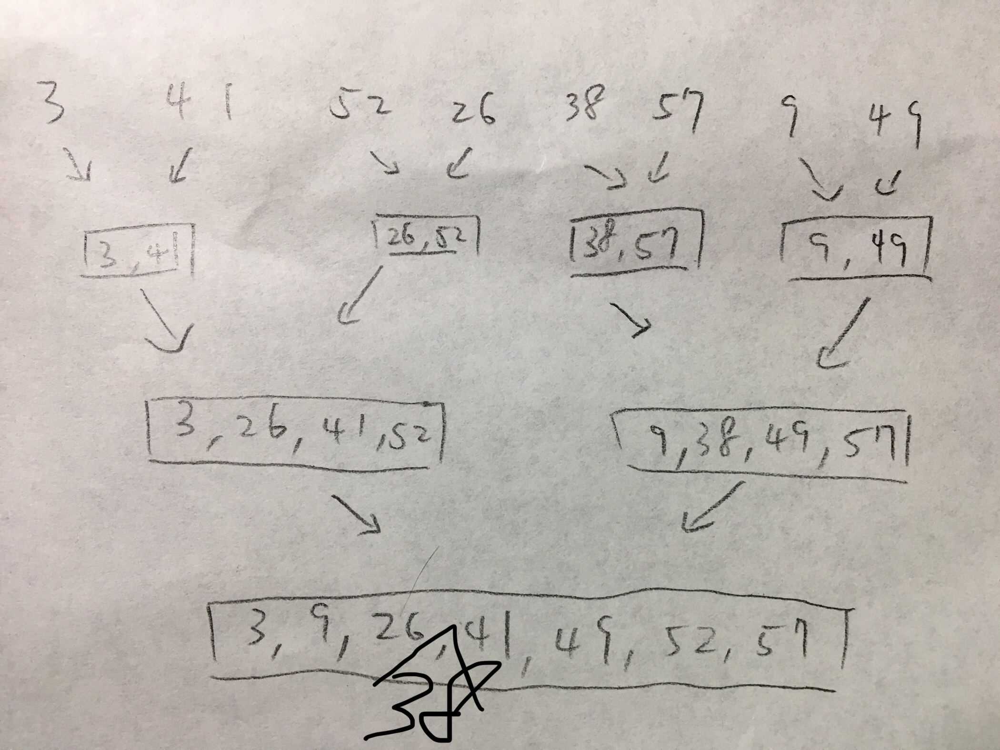

# Hw1
Computer Algorithm homework 1

## 2.1-2

Rewrite the INSERTION-SORT procedure to sort into non-increasing instead of non-decreasing order.

```py
INSERTION_SORT(A)
    for j = 2 to A.length
        key = A[j]
        i = j - 1
        
        while (i > 0 and A[i] < key)
            A[i+1] = A[i]
            i--
            
        A[i+1] = key

```


---

## 2.1-3
```py
Search(A, v)
    for i = 0 to A.length
        if (A[i] <span style="color: #EF5040"> v)
            return i
    return NIL
```

### Loop Invariant
$$\forall j < i \ ,\quad A[j] \neq v$$

### Initialization
$i=0$, therefore the statement is true.

### Maintenance
`A[0 : i-1]` doesn't contain v, and if `A[i] </span> v`, then we return `i` here.

### Termination
The Loop end with `i == A.lenght` , thus all of the elements in `A` are not equal to `v`.

---

## 2.2-3
Consider linear search again (see Exercise 2.1-3). How many elements of the input sequence need to be checked on the average, assuming that the element being searched for is equally likely to be any element in the array? How about in the worst case? What are the average-case and worst-case running times of linear search in $\Theta$-notation? Justify your answers.


Let $X$ be the random variable indicate the number of elements searched until we find `v`.

then
$$
\begin{align}
E(X) = \sum_{i=1}^{n}{\frac{i}{n}}=\frac{n+1}{2}\approx \frac{n}{2}
\end{align}
$$

In worse case, we find `v` at last element, thus it takes $n$ checks.


Running time of average case is
$$
\begin{gather}
\Theta(\frac{n}{2})=\Theta(n)
\end{gather}
$$

Running time of worse case :
$$
\begin{gather}
\Theta(n)
\end{gather}
$$
---

## 2.3-1



---

## 2.3-4
$$
T(n) = \left\{
\begin{align}
&T(n-1) + \Theta(n) \\\\
&\Theta(1), \quad \text{for} \quad n =1
\end{align}
\right.
$$


---

## 2-4

### a
{2, 1}, {3, 1}, {8, 6}, {8, 1}, {6, 1}
    
### b    
$\langle n, n-1, n-2, \dots, 2, 1 \rangle$

It has $\binom{n}{2}$ inversions.

### c
Insertion sort can be roughly written as
```py
for i = 0 to n
    for j = i to n
        // do something
```

Therefore the inner-loop would be run $\binom{n}{2}$ times in worst case.

As mentioned above, we have to compare each pair of element in array to find all of the inversions, in which same as insertion sort.


### d
```java

global num_inversion = 0

Merge_and_count_Inv(A, p, q, r)
    
    // divied array to left part and right part
    L = A[p : q]
    R = A[p+1 : r]
    
    L.push_back(∞)
    R.push_back(∞)
    
    L_idx = 0
    R_idx = 0
    
    for k = p to r
        if L[L_idx] <= R[R_idx] // no inversion in this case
            A[k] = L[L_idx++]
            
        else // this case indicates there are some inversion         here
            // ***** DIFFERENCE from the original Merge function *****
            num_inversion += L.size - L_idx
            // there are (L.size - L_idx) numbers greater than R[R_idx]
            A[k] = R[R_idx++]

```

We can count the number of inversion while doing merge sort.
The pseudo code above show how my algorithm works. The rest 
of merge sort is same as text-book.

---

## 3.1-1

$$
\begin{gather}
\exists\  n_0, \text{such that } 
\\\\
\text{avg}(f(n)+g(n)) = \frac{f(n)+g(n)}{2} \leq f(n)+g(n)
\\\\
f(n)+g(n) \geq \text{max}(f(n), g(n))
\end{gather}
$$
therefore, we get
$$
\begin{gather}
\frac{f(n)+g(n)}{2} \leq \max(f(n), g(n)) \leq  f(n)+g(n)
\\\\
c_1 = \frac{1}{2}, \qquad\qquad c_2 = 1
\end{gather}
$$
by definition
$$
\begin{align}
\max(f(n), g(n))=\Theta(f(n)+g(n))

\end{align}
$$


---

## 3.2-3
1. 
$$
\begin{gather}
\log(n!)=\sum_{i=1}^{n}{\log(i)}\approx\sum_{i=1}^{n}{\Theta(\log(n))}=\Theta(n\log(n))
\end{gather}
$$
<br>
1. 
$$
\begin{gather}
\lim_{n\to \infty}{\frac{2^n}{n!}=0}\\\\
\Rightarrow n!=\omega(2^n)
\end{gather}
$$
<br>
1. 
$$
\begin{gather}
\lim_{n \to \infty}{\frac{n^n}{n!}}=\infty
\\\\
\Rightarrow n!=o(n^n)
\end{gather}
$$
---

## 4.3-1
$$
\begin{align}
T(n) &= T(n-1) + O(n)\\\\
T(n-1) &= T(n-2) + O(n) \\\\
\vdots \\\\
T(1) &= O(n)
\\\\
\Rightarrow \sum_{i=1}^{n}{T(i)}&=\sum_{i=1}^{n-1} {T(i)} + nO(n)
\\\\
\Rightarrow T(n) &= O(n^2)

\end{align}
$$

---

## 4.3-5

$$
\begin{align}
T(n) &= 2T(\frac{n}{2}) + \Theta(n) \\\\
&= \Theta(n^{\log_22})+\sum_{j=0}^{\log_2{n}-1}{a^j\ f(\frac{n}{b^j})}

\\\\
&\text{accroding to Master Theorem}
\\\\
&=\Theta(n\log{n})


\end{align}
$$
---

## 4.3-9
$$
\begin{gather}
T(n) = 3T(\sqrt{n})+ \log{n}
\\\\
\text{let  }\log{n}=x \text{ , then}
\\\\
T(10^x)=3T(10^{\frac{x}{2}})+x
\\\\
\text{rename } T(10^x)=S(x)
\\\\
\implies S(x)=3S(\frac{x}{2})+x
\\\\
S(x) = \Theta(x^{\lg{3}})
\\\\
S(x)= T(10^x)=T(n) =\Theta(x^{\lg{3}})=\Theta(\log{n}^{\lg3})
\\\\

\end{gather}
$$


---

## 4.4-4
$$
\begin{align}
T(n) &= 2T(n-1) + 1
\\\\
\left(T(n)+1\right) &= 2\cdot(T(n-1) + 1)
\\\\
&=2^2\cdot(T(n-2) + 1)
\\\\
&= 2^{n-1}\cdot(T(1) + 1)
\\\\

\implies T(n) &= O(2^{n-1}) + O(1)=O(2^n)
\end{align}
$$
---

## 4.5-1
$$
\begin{gather}
n^{\log_4{2}} = n^{0.5} > n^0
\\\\
\text{accroding to master method, we have }\\\\

T(n)=\Theta(\sqrt{n})
\end{gather}
$$
---

## 4.5-3

$$
\begin{gather}
n^{\log_2{1}}=n^0=1
\\\\
\text{thus we have}
\\\\
T(n)=\Theta(\lg n)
\end{gather}
$$

---

## 4-1
#### f
$$
\begin{gather}
T(n)=2T(\frac{n}{4})+\sqrt{n}
\\\\
n^{\log_4{2}}=\sqrt{n}
\\\\
\text{accroding to master method, then}
\\\\
T(n)=\Theta(\sqrt{n}\lg{n})
\end{gather}
$$

#### g
$$
\begin{align}
T(n) &= T(n-2)+n^2
\\\\
 &=  T(n-4) + (n-2)^2 + n^2
 \\\\
 &= T(1) + 1^2+3^2+\dots+(n-2)^2+n^2
 \\\\
 &=\Theta(1) + \sum_{k=0}^{\frac{n}{2}-1}{(2k+1)^2}
 \\\\
 &=\Theta(n^3)
\end{align}
$$
---

## 4-3 b, c, f

#### b
$$
\begin{align}
T(n) &= 3T(\frac{n}{3})+\frac{n}{\lg{n}}
\\\\
&= \Theta(n)+\sum_{i=0}^{\log_3{n}-1}{\left(3^i\cdot\frac{\frac{n}{3^i}}{\lg{\frac{n}{3^i}}}\right)}
\\\\
&= \Theta(n) +\sum_{i=0}^{\log_3{n}-1}{\left(\frac{n}{\lg{n-i\lg3}}\right)}
\\\\
&= \Theta\left(\sum_{i=0}^{\lg{n}-1}{\frac{n}{\lg{n-i}}}\right)
\\\\
&= \Theta\left(\sum_{i=1}^{\lg{n}}{\frac{n}{i}}\right) = \Theta\big(n\lg{(\lg{n})}\big)
\end{align}
$$

#### c

$$
\begin{align}
T(n)&=4T\left(\frac{n}{2}\right)+n^2\sqrt{n}
\\\\
\end{align}
$$
$$
\begin{gather}
\because \quad \log_{2}{4}=2.5
\end{gather}
$$

#### f


$$
\begin{gather}
T(n)=T(\frac{n}{2})+T(\frac{n}{4})+T(\frac{n}{8})+n
\\\\
T(n)=T(\frac{n}{2})+T(\frac{n}{4})+T(\frac{n}{8})+n \geq n
\\\\
\implies T(n) = \Omega(n)
\end{gather}
$$

then assume $T(n) \leq cn$, for some $c > 0$

$$
\begin{align}
T(n)&=T(\frac{n}{2})+T(\frac{n}{4})+T(\frac{n}{8})+n
\\\\
&\leq c\left(\frac{n}{2}+\frac{n}{4}+\frac{n}{8}\right)+n
\\\\
&= \frac{7}{8}cn+n=(1+\frac{7}{8}c)\cdot n
\end{align}
$$

then when $c \geq 8$

$$
\begin{align}
T(n) \leq n\cdot (1+\frac{7}{8}c)\leq n\cdot(\frac{1}{8}c+\frac{7}{8}c)\leq cn
\end{align}
$$

finally we get

$$
\begin{gather}
T(n)= O(n) = \Omega(n) = \Theta(n)
\end{gather}
$$