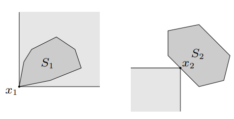
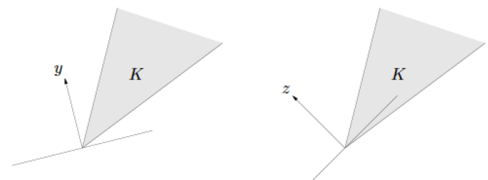

## Generalized Inequality

### Proper Cone

A convex cone $K \subseteq \mathbf R^n$ is a proper cone if

- $K$ is convex
- $K$ is closed (contains its boundary)
    - To show closed, check $\text{bd } K \in K$
- $K$ is solid (has nonempty interior)
    - To show solid, check $\text{int } K \in K$
- $K$ is pointed (contains no line)
    - To show pointed, check $v , -v \in K \implies v=0$

### Generalized Inequality

Generalized inequality defined by a proper cone $K$:

$$x \preceq_K y \iff y - x \in K$$
$$x \prec_K y \iff y - x \in \text{int } K$$

### Properties

- Preserved under addition
    - if $x \preceq_K y$ and $u\preceq_K v$, then $x+u \preceq_K y+v$
- Transitive
    - if $x \preceq_K y$ and $y \preceq_K z$, then $x\preceq_K z$
- Preserved under nonnegative scaling:
    - if $x\preceq_K y$ and $\alpha \ge 0$, then $\alpha x \preceq_K \alpha y$
- Reflexive
    - $x \preceq_K x$
- Antisymmetric
    - If $x \preceq_K y$ and $y \preceq_K x$, then $x=y$
- Preserved under limits
    - $x_i \preceq_K y_i$ for $i=1, 2,\dots,$, and as $i \to \infty$, $x_i \to x$ and $y_i \to y$, then $x\preceq_K y$
- Properties of strict generalized ineqalities
    - If $x \prec_K y$, then $x \preceq_K y$
    - If $x \prec_K y$ and $u \preceq_K v$, then $x+u \preceq_K y+v$
    - If $x \prec_K y$ and $\alpha > 0$, then $\alpha x \prec_K \alpha y$
    - $x \nprec_K x$
    - If $x \prec_K y$, then for $u$ and $v$ small enough, $x+u \prec_K y+v$

### Minimum & Minimal

- Minimum
    - All points are more than (or equal to) the minimum
- Minimal
    - No point is less than the minimal
    - A point $x \in S$ is the minimal element of $S$ iff $(x-K) \cap S = \set{x}$
        - Equivalently, if $y\in S$, $y \preceq_K x$ only if $y=x$
    - A point $x \in S$ is the maximal element of $S$ iff $(x+K)\cap S = \set{x}$
        - Equivalently, if $y\in S$, $y \succeq x$ only if $y=x$

- example ($K = \mathbf R_+$)
    - The concepts of minimal and minimum are the same.
- example ($K = \mathbf R^2_+$)
    - $x_1$ is the minimum element of $S_1$
    - $x_2$ is the minimal element of $S_2$

## Separating Hyperplane

 The hyperplane $\set{x \mid a^T x = b}$ is called a separating hyperplane for the sets $C$ and $D$, or is said to separate the sets $C$ and $D$ if $a^T x \le b$ for all $x\in C$ and $a^T x \ge b$ for all $x\in D$.
 
### Separating Hyperplane Theorem
Suppose $C$ and $D$ are two convex sets that do not intersect, i.e., $C\cup D = \emptyset$. Then, there exist $a \ne 0$ and $b$ such that the hyperplane $\set{x \mid a^T x = b}$ separates $C$ and $D$.

- Proof
    - Consider $C$ and $D$ are both convex, closed, and bounded
    - Assume that the Euclidean distance between $C$ and $D$ is positive
    - Since $C$ and $D$ are both closed and bounded, there exist $c\in C$ and $d\in D$ such that $$\Vert c -d \Vert_2 = \text{dist}(C,D)$$
    - Then $a=d-c$, $b =\frac{\Vert d \Vert^2_2 - \Vert c \Vert^2_2}{2}$

### Strict Separation

For two sets $C, D \subseteq \mathbf R^n$, if there exists $a \in \mathbf R^n, b \in \mathbf R$ such that

$$
\begin{gather}
a^T x < b \quad\forall x \in C \text{ and } a^T x > b \quad \forall x \in D
\end{gather}
$$

- Two disjoint convex sets are not necessary to be strict separation

### Converse of Separating Hyperplane Theorems

Any two convex sets, at least one of which is open, are disjoint iff there exists a separating hyperplane.

- If there exists a hyperplane that separates convex sets $C$ and $D$, does this imply $C$ and $D$ are disjoint?
    - No, $C=D=\set 0 \subseteq \mathbf R$
- E.g. Suppose $C$ and $D$ are convex sets, with $C$ open, and there exists an affine function $f$ that is nonpositive on $C$(actually, negative on $C$) and nonnegative on $D$. Then $C$ and $D$ are disjoint.

### Theorem of alternative for strict linear inequality

Let $A\in\mathbf R^{m\times n}$ and  $b\in \mathbf R^m$. The inequality $$Ax \prec b$$ is infeasible iff there exists $\lambda \in \mathbf R^m$ such that

$$
\begin{gather}
\lambda \ne 0, & \lambda \succeq 0, & A^T \lambda = 0, &\lambda ^T b \le 0
\end{gather}
$$

- Proof: given the above condition, $\lambda$ can be found it's a separating plane that separates $D=\mathbf R^m_{++}$ and $C=\set{b-A x \mid x \in \mathbf R^n}$. And since $D$ is open, $C$ and $D$ are disjoint, thereby the inequality is infeasible.

## Supporting Hyperplane

Suppose $C \subseteq \mathbf R^n$, and $x_0$ is a point in its boundary $\text{bd }C$, i.e.,

$$
\begin{gather}
x_0 \in \text{bd } C = \text{cl }C \setminus \text{int } C
\end{gather}
$$

If $a\ne 0$ satisfies $a^T x \le a^T x_0$ for all $x \in C$, then the hyperplane $\set{x \mid a^Tx = a^T x_0}$ is called *supporting hyperplane* to $C$ at the point $x_0$.

- Equivalently, $\set{x_0}$ and $C$ are separated by the hyperplane $\set{x \mid a^T x = a^T x_0}$
- The hyperplane is tangent to $C$ at $x_0$, and the halfspace $\set{x \mid a^T x \le a^T x_0}$ contains $C$.

### Supporting Hyperplane Theorem

For any nonempty convex set $C$, and any $x_0 \in \text{bd }C$, there exists a supporting hyperplane to $C$ at $x_0$.

- Proof (with the separating hyperplane theorem)
    - If $\text{int } C \ne \emptyset$: then by applying the separating hyperplane theorem on $\set {x_0}$ and $\text{int } C$, the statement is proved.
    - If $\text{int } C = \emptyset$: then $C$ lies in an affine set of dimension less than $n$. Then any hyperplane that contains this affine set contains both $C$ and $x_0$, and therefore is a supporting hyperplane.

### Converse of the Supporting Hyperplane Theorem

If a set $C$ is closed, has nonempty interior, and has a supporting hyperplane at any $x_0 \in \text{bd }C$, then $C$ is convex.

## Dual Cones

Let $K$ be a cone. The set

$$
\begin{gather}
K^* = \set{y \mid x^T y \ge 0  \,\forall x \in K}
\end{gather}
$$
is called the dual cone of $K$.

- Properties
    - $K^*$ is a cone
    - $K^*$ is convex (even when $K$ is not convex) and closed
    - $K_1 \subseteq K_2$ implies $K^*_2 \subseteq K_1^*$
    - If $K$ has nonempty interior, then $K^*$ is pointed
    - If the closure of $K$ is pointed, then $K^*$ has nonempty interior
    - $K^{**}$ is the closure of the convex hull of $K$
    - If $K$ is convex and closed, then $K^{**} = K$
    - If $K$ is a proper cone, then
        - $K^*$ is also a proper cone
        - $K^{**} = K$
- $y\in K^*$ iff $-y$ is the normal vector of a hyperplane that supports $K$ at the origin
    

- The dual cone of a subspace $V \subseteq \mathbf R^n$ (which is a cone) is its orthogonal complement $$V^\bot = \set{y \mid y^T v = 0\, \forall v\in V}$$
- A cone is called *self-dual* if it is its own dual
    - E.g. $\mathbf R^n_+$
    - E.g. $\mathbf S_+^n$
        - $\text{tr }(XY) \ge 0 \,\forall X \succeq 0 \iff Y \succeq 0$

### Dual Generalized Inequalities

If $K$ is a proper cone which induces a generalized inequality $\preceq_K$. Then we refer to the generalized inequality $\preceq_K^*$ as the dual of the generalized inequality $\preceq_K$ (note that $K^*$ is also a proper cone).

- $x \preceq_K y$ iff $\lambda ^T x \le \lambda ^T y$ for all $\lambda \succeq_{K^*} 0$.
- $x \prec_K y$ iff $\lambda ^T x < \lambda ^T y$ for all $\lambda \succeq_{K^*} 0, \lambda \ne 0$.

### Theorem of Alternatives for Strict Generalized Inequalities

Suppose $K \subseteq \mathbf R^m$ is a proper cone. The strict generalized inequality

$$
\begin{gather}
Ax \prec_K b
\end{gather}
$$

where $x \in \mathbf R^n$, is infeasible iff there exists $\lambda \in \mathbf R^m$ s.t.

$$
\begin{gather}
\lambda \ne 0, & \lambda \succeq_{K^*} 0, &
A^T \lambda = 0, & \lambda b \le 0
\end{gather}
$$

### Minimum & Minimal Elements via Dual Characterization

#### Minimum

Consider a set $S \subseteq \mathbf R^n$, not necessarily convex. Then $x$ is the minimum element of $S$, w.r.t the generalized inequality $\preceq_K$, iff for all $\lambda_{K^*} 0$

#### Minimal

If $\exists \lambda \succ_{K^*} 0$, and $x$ minimizes $\lambda^T z$ over $z \in S$, then $x$ is minimal

The converse is not true: if $x$ is minimal in $S$, there does not necessarily exist $\lambda \succ_{K^*} 0$ such that $x$ minimizes $\lambda^T z$ over $z \in S$. (E.g. $S$ is not convex.)

- A point $x$ can be a minimal point of a convex set $X$, but not a minimizer of $\lambda^T z$ over $z \in S$ for any $\lambda \succ_{K^*}0$
    - So we need $\lambda \succeq_{K^*} 0$ and $\lambda \ne 0$

## Monotonicity

Suppose $K\subseteq \mathbf R^n$ is a proper cone with associated generalized inequality $\preceq_K$. A function $\mathbf R^n \to \mathbf R$ is called $K$-nondecreasing

if $$x \preceq_K y \implies f(x) \le f(y),$$

and $K$-increasing if $$x \preceq_K y,\, x\ne y \implies f(x) < f(y).$$

- Example: Monotone Vector Function
    - A function $f: \mathbf R^n \to \mathbf R$ is nondecreasing w.r.t. $\mathbf R^n_+$ iff $$x_1 \le y_1, \dots, x_n \le y_n \implies f(x) \le f(y)$$

## Convexity 

Suppose $K \subset \mathbf R^m$ is a proper cone. We say $f: \mathbf R^n\to \mathbf R^m$ is $K$-convex if for all $x, y \in \mathbf R^n$, and $0\le \theta \le 1$,

$$
f(\theta x+ (1-\theta)y) \preceq_K \theta f(x) + (1-\theta)f(y)
$$

The function $f$ is said to be strictly $K$-convex if $\forall x, y \in \mathbf R^n$, $x\ne y$, $\forall \theta$, $0< \theta < 1$

$$
f(\theta x+ (1-\theta)y) \prec_K \theta f(x) + (1-\theta)f(y)
$$