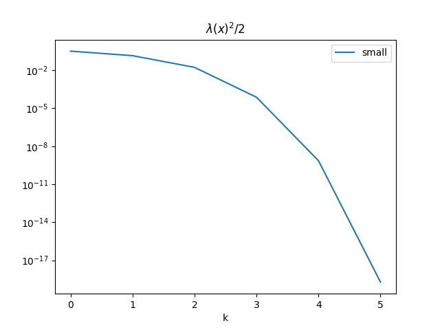
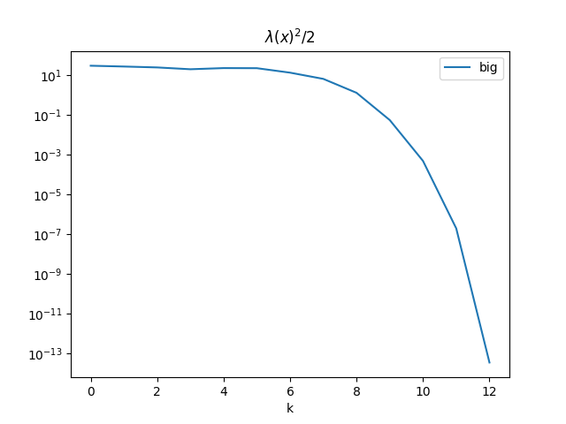

## 1.

In this section, the results are solved using smaller $A, b, c$, with $m=3, n=2$.

### (a)

$$
\begin{gather}
\text{dom }f = \set{x \in \mathbf R^n \mid Ax-b \succ 0} = \bigcap_{i=1}^m\set{x \mid a_i^T x -b  >0}
\end{gather}
$$

The $\text{dom } f$ is a intersection of $m$ halfspaces which are convex, and is thus convex.

### (b)

let $g(x) = \sum\limits_{i=1}^m\log(a_i^T x - b_i)$, and $h(u) = \sum\limits_{i=1}^m \log(u)$, where $u = Ax -b$.

- $\nabla f(x)$
$$
\begin{gather}
\nabla g(x) = A^T \nabla h(u)
=A^T
\begin{bmatrix}
\frac{1}{a_1^T x - b_1} \\ \vdots \\ \frac{1}{a_m^T x - b_m}
\end{bmatrix}
\end{gather}
$$

$$
\begin{gather}
\nabla f(x) = c - \nabla g(x) = c - A^T
\begin{bmatrix}
\frac{1}{a_1^T x - b_1} \\ \vdots \\ \frac{1}{a_m^T x - b_m}
\end{bmatrix}
=c-\sum\limits_{i=1}^m \frac{a_i}{a_i^T x - b_i}
\end{gather}
$$

- $\nabla^2 f(x)$
$$
\begin{gather}
\nabla^2 g(x) = A^T \text{diag}(
\begin{bmatrix}
\frac{-1}{(a_1^T x - b_1)^2} &\dots & \frac{-1}{(a_m^T x - b_m)^2}
\end{bmatrix}
)A
\end{gather}
$$
$$
\begin{align}
\nabla^2 f(x) &=-\nabla^2 g(x)= A^T \text{diag}(
\begin{bmatrix}
\frac{1}{(a_1^T x - b_1)^2} &\dots & \frac{1}{(a_m^T x - b_m)^2}
\end{bmatrix}
)A
\\
&= \sum\limits_{i=1}^m\frac{a_i a_i^T}{(a_i^T x - b_i)^2}
\end{align}
$$
### (j) Results

|   i |      pi |      lambda |  ti |
| ---:| -------:| -----------:| ---:|
|   0 | 6.21461 |    0.802939 |   1 |
|   1 | 5.80065 |    0.533146 |   1 |
|   2 | 5.63139 |     0.18413 |   1 |
|   3 | 5.61371 |   0.0121706 |   1 |
|   4 | 5.61364 | 3.79297e-05 |   1 |
|   5 | 5.61364 | 6.12745e-10 |   1 |



### (k) Comparison of Results Obtained through Different Methods

$$
\begin{align}
p^* &=  5.613637910632322
\\
p^*_{\text{cvx}} &= 5.613637931327619
\end{align}
$$

The results from two different methods are very similar.

$$
\begin{gather}
\Vert x^* - x^*_{\text{cvx}}\Vert_2 = 1.29 \times 10^{-5}
\\\\
\vert p^* - p^*_{\text{cvx}}\vert = 2.07 \times 10^{-8}
\end{gather}
$$

```
x* =  [0.0186059  0.04698939]
```

---

## 2.

In this section, the results are solved using bigger $A, b, c$, with $m=100, n=50$.

### (j) Results

|    |       pi |      lambda |   ti |
|---:|---------:|------------:|-----:|
|  0 | -414.054 | 7.73194     | 0.49 |
|  1 | -437.445 | 7.38028     | 0.7  |
|  2 | -465.606 | 7.00303     | 0.7  |
|  3 | -490.477 | 6.30442     | 1    |
|  4 | -517.526 | 6.739       | 1    |
|  5 | -548.308 | 6.70256     | 1    |
|  6 | -575.179 | 5.17527     | 1    |
|  7 | -591.143 | 3.60894     | 1    |
|  8 | -598.743 | 1.61196     | 1    |
|  9 | -600.161 | 0.332663    | 1    |
| 10 | -600.219 | 0.0312664   | 1    |
| 11 | -600.219 | 0.000630634 | 1    |
| 12 | -600.219 | 2.67875e-07 | 1    |



### (k) Comparison of Results Obtained through Different Methods

$$
\begin{align}
p^* &=  -600.2190945266377 
\\
p^*_{\text{cvx}} &= -600.2190935331813
\end{align}
$$
The results from two different methods are very similar.

$$
\begin{gather}
\Vert x^* - x^*_{\text{cvx}}\Vert_2 = 4.32 \times 10^{-2}
\\\\
\vert p^* - p^*_{\text{cvx}}\vert = 9.93 \times 10^{-7}
\end{gather}
$$

```
x* =  [-204.3035628   -54.70341558 -535.63006647   56.45417765 -181.50792096
  222.6562595   193.85819155  -99.41164414  192.68155773  705.40207745
   81.73640232   37.97922179 -277.41632585  531.72928021 -184.33642319
  311.08859824  336.26750334   44.67501148  591.85569921 -172.82848882
  117.81695463  454.94449063  554.38765933  393.59187161 -204.51322545
   16.47806879 -140.08388433  -90.68497034  424.59539696  621.18592425
  540.07846143 -274.6705666  -395.11350235  814.51926437  250.08464048
  135.69312918   91.14971872  384.34781442  315.24769443 -567.98227515
 -675.3958356  -876.31296632 -484.96410785 -475.84162414 -334.38667647
   86.788361    238.01898451  399.67963843 -219.75097358 -562.664404  ]
```

## Codes

`q1.py`, `q2.py` for the question 1 and question 2, respectively.

Notice that `q2.py` requires the csv files to be put in the same directory to load them.