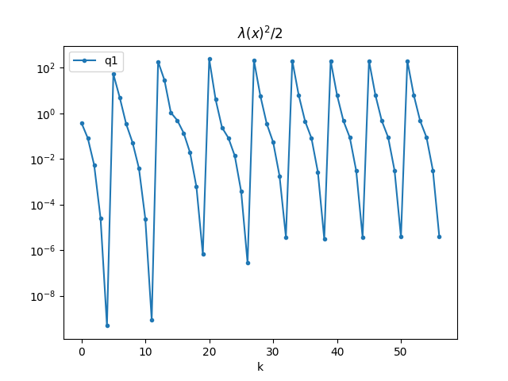
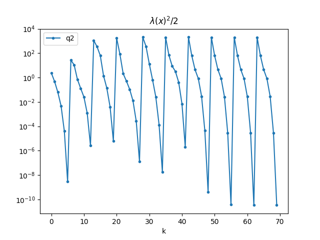

## 1.
### (a) Gradient and Hessian

$$
\begin{align}
\text{dom }\phi(x)
&= \set{x \mid f_i(x) < 0, i=1, \dots, m}
\\
&= \set{x \mid a_i^T x - b_i < 0, i=1, \dots, m}
\\\\
\nabla \phi(x) &= -\sum\limits_{i=1}^m{\frac{\nabla f_i(x)}{f_i(x)}}
= \sum\limits_{i=1}^m\frac{-a_i}{a_i^T x - b_i}
\\
\nabla^2 \phi(x)
&= \sum\limits_{i=1}^m\frac{a_i a_i^T}{(a_i^T x - b_i)^2}
\end{align}
$$

Therefore, 

$$
\begin{align}
\nabla f(x) &= t c - \sum\limits_{i=1}^m\frac{a_i}{a_i^T x - b_i}
\\
\nabla^2 f(x) &= \sum\limits_{i=1}^m\frac{a_i a_i^T}{(a_i^T x - b_i)^2}
\end{align}
$$

### (d) Random Generation

```
A = [[-0.05402842 -0.31270051 -0.61699428  0.04666923 -0.93128381]
 [-0.43865821  1.8680176   0.37624115  0.3645461   0.46150843]
 [-1.07115524  0.97772421 -0.43938974 -0.6335467  -0.13618383]
 [-1.07162083  0.14502761 -0.57483498  1.31886847 -1.12086461]
 [ 0.31797642 -0.18194314 -0.5146945   0.93942853 -0.60602019]
 [ 0.90556765 -0.90793214  1.17677921 -0.91921925  0.26278814]
 [ 0.14016163  0.83228442 -0.70610951  0.20504117  0.25963069]
 [ 1.83059003 -1.43487619  1.01019899 -0.47436497 -0.59245353]
 [ 0.37324744  0.41732675  1.14367764 -0.38709756  0.00511141]
 [ 0.7492088  -0.26809462  0.1704041   0.9771985   1.34446126]]
b = [-0.18863537  0.7692414   1.68114438 -0.19355341  1.81031874  0.53772832
  1.08760924  1.23839024  0.76650324 -0.07097034]
c = [-0.42379563 -1.89566042 -0.73091208 -0.16275548 -0.73924165]
x0 = [-0.9712037  -0.03170496 -0.07443492 -0.83147292  0.76208264]
```

### (j) Records

| global_k | inner_k |       $f(x)$ |   $\lambda$ |         s |
| -------: | ------: | -----------: | ----------: | --------: |
|        0 |       0 |      2.86226 |    0.881432 |         1 |
|        1 |       1 |       2.3918 |    0.404432 |         1 |
|        2 |       2 |       2.2989 |    0.103621 |         1 |
|        3 |       3 |       2.2933 |  0.00699303 |         1 |
|        4 |       4 |      2.29328 | 3.10862e-05 |         1 |
|        5 |       0 |      7.92437 |     10.2917 |  0.117649 |
|        6 |       1 |     -2.57957 |       3.137 |     0.343 |
|        7 |       2 |     -5.07802 |    0.831328 |         1 |
|        8 |       3 |     -5.33094 |    0.324578 |         1 |
|        9 |       4 |     -5.39115 |   0.0885857 |         1 |
|       10 |       5 |     -5.39526 |  0.00691659 |         1 |
|       11 |       6 |     -5.39529 | 4.17717e-05 |         1 |
|       12 |       0 |     -124.703 |     19.2505 | 0.0823543 |
|       13 |       1 |     -152.922 |     7.52281 |    0.2401 |
|       14 |       2 |     -161.062 |      1.4628 |         1 |
|       15 |       3 |     -161.915 |    0.996125 |         1 |
|       16 |       4 |     -162.531 |    0.524509 |         1 |
|       17 |       5 |     -162.694 |    0.194563 |         1 |
|       18 |       6 |     -162.715 |   0.0345299 |         1 |
|       19 |       7 |     -162.715 |  0.00114706 |         1 |
|       20 |       0 |     -1822.36 |     21.9064 | 0.0823543 |
|       21 |       1 |     -1857.76 |     2.84441 |      0.49 |
|       22 |       2 |     -1859.52 |    0.692251 |         1 |
|       23 |       3 |     -1859.82 |    0.408562 |         1 |
|       24 |       4 |     -1859.92 |     0.16505 |         1 |
|       25 |       5 |     -1859.94 |   0.0272381 |         1 |
|       26 |       6 |     -1859.94 | 0.000741852 |         1 |
|       27 |       0 |     -18906.7 |     20.3539 | 0.0823543 |
|       28 |       1 |     -18937.7 |     3.42496 |      0.49 |
|       29 |       2 |     -18940.2 |    0.836258 |         1 |
|       30 |       3 |     -18940.6 |    0.330502 |         1 |
|       31 |       4 |     -18940.7 |   0.0600925 |         1 |
|       32 |       5 |     -18940.7 |  0.00275511 |         1 |
|       33 |       0 |      -189819 |     20.1322 | 0.0823543 |
|       34 |       1 |      -189849 |     3.54694 |      0.49 |
|       35 |       2 |      -189852 |    0.948381 |         1 |
|       36 |       3 |      -189852 |    0.402908 |         1 |
|       37 |       4 |      -189852 |    0.073113 |         1 |
|       38 |       5 |      -189852 |  0.00246561 |         1 |
|       39 |       0 | -1.89904e+06 |     20.1031 | 0.0823543 |
|       40 |       1 | -1.89907e+06 |     3.56328 |      0.49 |
|       41 |       2 | -1.89907e+06 |    0.965082 |         1 |
|       42 |       3 | -1.89907e+06 |    0.416549 |         1 |
|       43 |       4 | -1.89907e+06 |   0.0776144 |         1 |
|       44 |       5 | -1.89907e+06 |   0.0026964 |         1 |
|       45 |       0 | -1.89914e+07 |     20.0979 | 0.0823543 |
|       46 |       1 | -1.89914e+07 |     3.56618 |      0.49 |
|       47 |       2 | -1.89914e+07 |    0.968127 |         1 |
|       48 |       3 | -1.89914e+07 |     0.41916 |         1 |
|       49 |       4 | -1.89914e+07 |   0.0785739 |         1 |
|       50 |       5 | -1.89914e+07 |  0.00276109 |         1 |
|       51 |       0 | -1.89915e+08 |      20.097 | 0.0823543 |
|       52 |       1 | -1.89915e+08 |     3.56668 |      0.49 |
|       53 |       2 | -1.89915e+08 |     0.96865 |         1 |
|       54 |       3 | -1.89915e+08 |    0.419613 |         1 |
|       55 |       4 | -1.89915e+08 |   0.0787431 |         1 |
|       56 |       5 | -1.89915e+08 |  0.00277293 |         1 |



### (k) Results

- (1) The number of outer iterations: $9$
- (2) For each outer iteration, the number of inner Newton steps, $t$
- (3) For each end of outer iteration, $t$, $f(x)$

| outer iteration | \#netwon_steps |         f(x) |      t |
| --------------: | -------------: | -----------: | -----: |
|               0 |              5 |      2.29328 |      1 |
|               1 |              7 |     -5.39529 |     10 |
|               2 |              8 |     -162.715 |    100 |
|               3 |              7 |     -1859.94 |   1000 |
|               4 |              6 |     -18940.7 |  10000 |
|               5 |              6 |      -189852 | 100000 |
|               6 |              6 | -1.89907e+06 |  1e+06 |
|               7 |              6 | -1.89914e+07 |  1e+07 |
|               8 |              6 | -1.89915e+08 |  1e+08 |

- (4) The total number of Newton steps: 57
- (5) The optimal point $x^*$ and optimal value $p^*$

```
x* = [ 1.25047273  0.92629285 -0.40692419 -0.77471887  0.04975544]
p* =  -1.8991473025572656
```

### (m) Results from CVX

```
p_cvx* = -1.8991473525394202
x_cvx* = [ 1.25047279  0.92629287 -0.40692419 -0.77471885  0.04975541]
```

$$
\begin{align}
|p^* - p_\text{cvx}^* | &= 5.00 \times 10^{-8}
\\\\
\Vert x^* - x_\text{cvx}^* \Vert_2 &= 7.53 \times 10^{-8}
\end{align}
$$

---

## 2.

### (j) Records

|    |   inner_k |              f(x) |       lambda |         s |
|---:|----------:|------------------:|-------------:|----------:|
|  0 |         0 |      36.8262      |  2.21649     | 1         |
|  1 |         1 |      34.6244      |  0.989669    | 1         |
|  2 |         2 |      34.0582      |  0.355458    | 1         |
|  3 |         3 |      33.9862      |  0.0971544   | 1         |
|  4 |         4 |      33.9812      |  0.0089477   | 1         |
|  5 |         5 |      33.9812      |  7.69138e-05 | 1         |
|  6 |         0 |      29.4443      |  7.33921     | 0.343     |
|  7 |         1 |      15.8653      |  4.69395     | 0.7       |
|  8 |         2 |       6.77827     |  1.19622     | 1         |
|  9 |         3 |       6.00408     |  0.509358    | 1         |
| 10 |         4 |       5.84707     |  0.224407    | 1         |
| 11 |         5 |       5.81876     |  0.0488158   | 1         |
| 12 |         6 |       5.81753     |  0.00230371  | 1         |
| 13 |         0 |    -450.034       | 47.1485      | 0.057648  |
| 14 |         1 |    -573.027       | 26.3433      | 0.117649  |
| 15 |         2 |    -647.417       | 11.305       | 0.343     |
| 16 |         3 |    -678.359       |  1.67621     | 1         |
| 17 |         4 |    -679.427       |  0.520595    | 1         |
| 18 |         5 |    -679.575       |  0.0884938   | 1         |
| 19 |         6 |    -679.579       |  0.00361839  | 1         |
| 20 |         0 |   -8091.97        | 59.7967      | 0.0823543 |
| 21 |         1 |   -8360.09        | 13.0399      | 0.343     |
| 22 |         2 |   -8398.29        |  2.06718     | 1         |
| 23 |         3 |   -8400.17        |  1.01269     | 1         |
| 24 |         4 |   -8400.79        |  0.466507    | 1         |
| 25 |         5 |   -8400.91        |  0.158647    | 1         |
| 26 |         6 |   -8400.93        |  0.0231615   | 1         |
| 27 |         7 |   -8400.93        |  0.000518047 | 1         |
| 28 |         0 |  -86297.1         | 64.1446      | 0.057648  |
| 29 |         1 |  -86523.4         | 26.8896      | 0.16807   |
| 30 |         2 |  -86625.7         |  5.16411     | 0.7       |
| 31 |         3 |  -86634           |  1.14281     | 1         |
| 32 |         4 |  -86634.7         |  0.223706    | 1         |
| 33 |         5 |  -86634.8         |  0.016169    | 1         |
| 34 |         6 |  -86634.8         |  0.000191929 | 1         |
| 35 |         0 | -869674           | 63.5798      | 0.0823543 |
| 36 |         1 | -869976           | 11.7176      | 0.2401    |
| 37 |         2 | -870004           |  4.19854     | 1         |
| 38 |         3 | -870006           |  2.51234     | 1         |
| 39 |         4 | -870009           |  0.903943    | 1         |
| 40 |         5 | -870010           |  0.117793    | 1         |
| 41 |         6 | -870010           |  0.00203407  | 1         |
| 42 |         0 |      -8.70447e+06 | 63.9062      | 0.0823543 |
| 43 |         1 |      -8.70477e+06 | 11.1562      | 0.49      |
| 44 |         2 |      -8.7048e+06  |  2.98815     | 1         |
| 45 |         3 |      -8.7048e+06  |  1.28418     | 1         |
| 46 |         4 |      -8.70481e+06 |  0.241385    | 1         |
| 47 |         5 |      -8.70481e+06 |  0.00942048  | 1         |
| 48 |         6 |      -8.70481e+06 |  2.80892e-05 | 1         |
| 49 |         0 |      -8.70535e+07 | 63.6818      | 0.0823543 |
| 50 |         1 |      -8.70538e+07 | 11.2073      | 0.49      |
| 51 |         2 |      -8.70538e+07 |  2.99249     | 1         |
| 52 |         3 |      -8.70538e+07 |  1.27116     | 1         |
| 53 |         4 |      -8.70538e+07 |  0.230555    | 1         |
| 54 |         5 |      -8.70538e+07 |  0.00765523  | 1         |
| 55 |         6 |      -8.70538e+07 |  8.66256e-06 | 0.2401    |
| 56 |         0 |      -8.70544e+08 | 63.6438      | 0.0823543 |
| 57 |         1 |      -8.70545e+08 | 11.2273      | 0.49      |
| 58 |         2 |      -8.70545e+08 |  3.00908     | 1         |
| 59 |         3 |      -8.70545e+08 |  1.28059     | 1         |
| 60 |         4 |      -8.70545e+08 |  0.231968    | 1         |
| 61 |         5 |      -8.70545e+08 |  0.00761582  | 1         |
| 62 |         6 |      -8.70545e+08 |  8.22562e-06 | 0.7       |
| 63 |         0 |      -8.70546e+09 | 63.64        | 0.0823543 |
| 64 |         1 |      -8.70546e+09 | 11.2295      | 0.49      |
| 65 |         2 |      -8.70546e+09 |  3.01131     | 1         |
| 66 |         3 |      -8.70546e+09 |  1.28241     | 1         |
| 67 |         4 |      -8.70546e+09 |  0.232578    | 1         |
| 68 |         5 |      -8.70546e+09 |  0.00764998  | 1         |
| 69 |         6 |      -8.70546e+09 |  8.45459e-06 | 1         |



### (k) Results

- (1) The number of outer iterations: $10$
- (2) For each outer iteration, the number of inner Newton steps, $t$
- (3) For each end of outer iteration, $t$, $f(x)$

| outer iteration | \#netwon_steps |        $f(x)$ |    $t$ |
| ---------------:| --------------:| ------------:| ------:|
|               0 |              6 |      33.9812 |      1 |
|               1 |              7 |      5.81753 |     10 |
|               2 |              7 |     -679.579 |    100 |
|               3 |              8 |     -8400.93 |   1000 |
|               4 |              7 |     -86634.8 |  10000 |
|               5 |              7 |      -870010 | 100000 |
|               6 |              7 | -8.70481e+06 |  1e+06 |
|               7 |              7 | -8.70538e+07 |  1e+07 |
|               8 |              7 | -8.70545e+08 |  1e+08 |
|               9 |              7 | -8.70546e+09 |  1e+09 |

- (4) The total number of Newton steps: 70
- (5) The optimal point $x^*$ and optimal value $p^*$

```
x* = [ 2.45814628e-03 -2.42396002e-04 -1.67457649e-03  1.07848526e-02
  6.76722690e-03 -5.37674095e-03  7.14985596e-03  7.33947297e-03
  8.74765954e-03 -9.70939636e-03 -2.38032829e-04 -1.11508308e-02
 -3.60878176e-03  1.23387330e-02 -7.65978720e-03 -5.70389620e-03
  2.48091133e-03  6.86662131e-03 -6.66111010e-03 -8.27321378e-03
  3.37993632e-03  8.32295678e-03 -5.35871162e-03  1.36954324e-02
 -1.06134616e-02  8.93044678e-03 -2.07117712e-03 -7.86136045e-04
 -4.43003331e-03 -6.48894296e-03 -1.04681234e-02 -3.34570433e-03
  3.12546916e-05  9.47445309e-03  4.70676833e-03  4.60529006e-03
  4.94244406e-03 -9.03756572e-04  2.92016678e-03 -2.42077591e-03
 -5.72344098e-03  2.30196244e-03  2.40636851e-04  3.25191115e-03
 -4.45260094e-03  2.21587960e-03  3.53462204e-03  1.18064878e-03
 -1.47346790e-05  9.77856091e-03]
p* =  -8.705457027781526
```

### (m) Results from CVX

```
x_cvx* = [ 2.45814620e-03 -2.42395888e-04 -1.67457631e-03  1.07848526e-02
  6.76722687e-03 -5.37674102e-03  7.14985577e-03  7.33947307e-03
  8.74765956e-03 -9.70939646e-03 -2.38032958e-04 -1.11508306e-02
 -3.60878186e-03  1.23387331e-02 -7.65978739e-03 -5.70389623e-03
  2.48091164e-03  6.86662161e-03 -6.66111006e-03 -8.27321375e-03
  3.37993606e-03  8.32295671e-03 -5.35871158e-03  1.36954324e-02
 -1.06134616e-02  8.93044697e-03 -2.07117723e-03 -7.86135729e-04
 -4.43003338e-03 -6.48894273e-03 -1.04681234e-02 -3.34570448e-03
  3.12544720e-05  9.47445306e-03  4.70676853e-03  4.60529033e-03
  4.94244424e-03 -9.03756682e-04  2.92016665e-03 -2.42077610e-03
 -5.72344119e-03  2.30196254e-03  2.40637152e-04  3.25191101e-03
 -4.45260101e-03  2.21587973e-03  3.53462241e-03  1.18064885e-03
 -1.47345732e-05  9.77856069e-03]
p_cvx* = -8.705457106904579
```

$$
\begin{align}
|p^* - p_\text{cvx}^* | &= 7.91 \times 10^{-8}
\\\\
\Vert x^* - x_\text{cvx}^* \Vert_2 &= 1.16 \times 10^{-9}
\end{align}
$$

<div style="page-break-after: always; visibility: hidden"></div>

## Code Instruction

There are three python files `my_objective_with_log_barrier.py`,  `main1.py` and `main2.py`. The `main2.py` requires the big csv files in the same directory.

Notice that the `main1.py` involves random number generation. Although random seed was set, the results likely differ across environments.

To reproduce, some of the important versions of packages are listed below. The python itself should be later than `3.10`.

```requirements
numpy<span style="color: #EF5040">1.25.0
pandas</span>2.1.1
tabulate<span style="color: #EF5040">0.9.0
cvxpy</span>1.5.1
matplotlib==3.8.0
```
