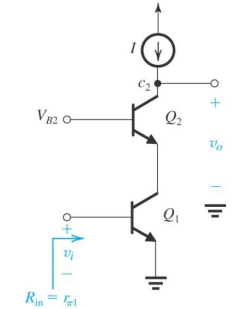
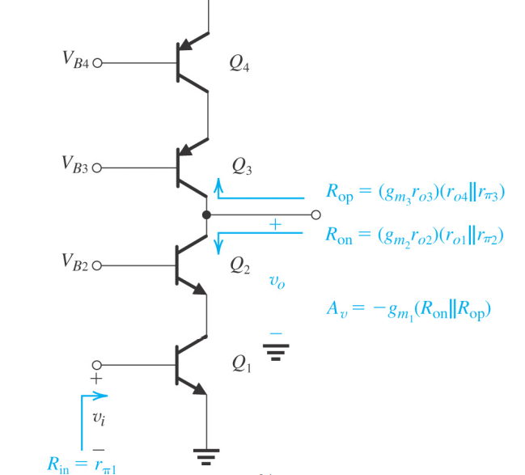

## BJT Cascode

 $$
 \begin{gather}
 G_m = \frac{i_o}{v_i}
 \\\\
 R_{in} = r_{\pi 1}
 \end{gather}
 $$
 
 $$
 \begin{align}
  R_o &= r_{o2}+(r_{o1} // r_{\pi 2})(1+g_{m2}\ r_{o2})
  \\\\
  &\approx(r_{o1}//r_{\pi2}) (g_{m2}\ r_{o2})
  \\\\
  &\approx(r_{\pi2})(g_{m2}\ r_{o2})=\beta_{2}\, r_{o2}
 \end{align}
 $$
 
 
 
 

$$
\begin{gather}
A_{v} = -g_{m_{1}R_{o}}
\end{gather}
$$

- 因為放大率疊加了不會一直變大，所以沒有 BJT double cascode

---