## Common-Mode Input Voltage
### MOS
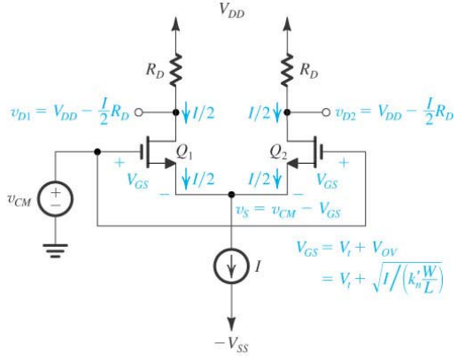

- $V_{CS}$ 是 source $I$ （相當於一個 MOS）的跨壓

$$
\begin{gather}
v_{CM max} = v_{D}+V_{t} = (V_{DD}-\frac{I}{2}R_{D})+V_{T}
\\\\
v_{CM min} = -V_{ss}+V_{CS}+V_{GS}
\end{gather}
$$

---
### BJT
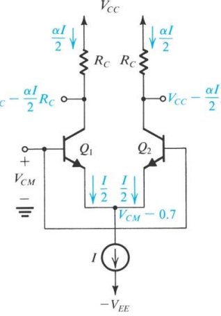

- For Q1, Q2 in active

$$
\begin{gather}
V_{CC} - \frac{\alpha I}{2}R_{C} - (V_{CM} - 0.7) \geq 0.3
\\\\
V_{CM} \leq V_{CC}-\frac{\alpha I}{2}R_{C}+0.4
\end{gather}
$$

- For Q3 (current source) ($V_{CS}$ is voltage of current source)

$$
\begin{gather}
V_{CM} \geq -V_{EE} + V_{CS} + 0.7
\end{gather}
$$

---

## Differential-Mode Input Voltage
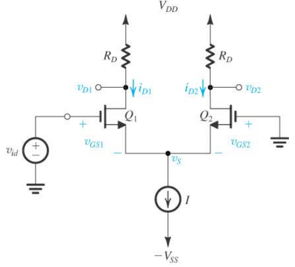

- $v_{id} = v_{GS1} - v_{GS2}$
- $v_{id}$ 的最大值發生在 $Q_{2}$ 不通，最小值在 $Q_{1}$ 不通
- $Q_{2}$不通 $\implies V_{GS2} < V_{t} \implies V_{S} > -V_{t}$
- $v_{id}$ 越大，$\frac{i_{D1}}{i_{D2}}$ 越大
- $-\sqrt{2} V_{OV} \leq v_{id} \leq \sqrt{2} V_{OV}$
- 這裡的$V_{OV}$ 是當電流一人一半時的 $V_{OV}$

---

## Large-Signal Operation
### MOS
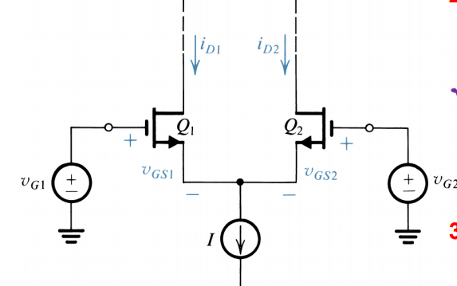

- 背
$$
\begin{gather}
i_{D1}=\frac{I}{2}+\frac{I}{V_{OV}}\cdot \frac{v_{id}}{2}\cdot \sqrt{1-\left(\frac{v_{id}/2}{V_{OV}}\right)^{2}}
\\\\
i_{D2}=\frac{I}{2}-\frac{I}{V_{OV}}\cdot 
\frac{v_{id}}{2}\cdot \sqrt{1-\left(\frac{v_{id}/2}{V_{OV}}\right)^{2}}
\end{gather}
$$

### BJT
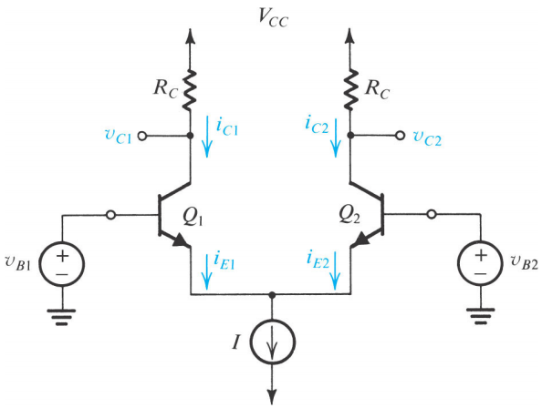
$$
\begin{gather}
i_{E1} = \frac{I_{S}}{\alpha}e^{(v_{B1}-v_{E})/V_{T}}=\frac{I}{1+e^{(v_{B1}-v_{B2})/V_{T}}}=\frac{I}{1+e^{-v_{id}/V_{T}}}
\\\\
i_{E2} = \frac{I_{S}}{\alpha}e^{(v_{B2}-v_{E})/V_{T}}=\frac{I}{1+e^{(v_{B2}-v_{B1})/V_{T}}}=\frac{I}{1+e^{v_{id}/V_{T}}}
\end{gather}
$$

---

## Small-Signal Operation
### MOS
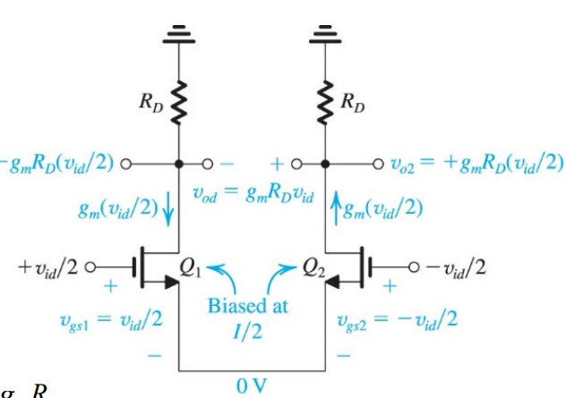

- $g_{m}=\frac{2I_{D}}{V_{OV}}=\frac{I}{V_{OV}}$
- $v_{o1}=-g_{m}\frac{v_{id}}{2}\cdot (R_{D}//r_{o})$
- $v_{o2}=+g_{m} \frac{v_{id}}{2}\cdot (R_{D}//r_{o})$

#### single-end
- $v_{o} = v_{o1} \text{ or } v_{o2}$
- $A_{d} \equiv \frac{v_{o2}-v_{o1}}{v_{id}}=g_{m} (R_{D}//r_{o})$
$$
\begin{gather}
A_{cm}=-\frac{v_{o1}}{v_{icm}}=-\frac{v_{o2}}{v_{icm}}=-\frac{R_{D}}{2R_{SS}}
\\\\
A_{d}= -\frac{v_{o1}}{v_{id}}=-\frac{1}{2}g_{m}R_{D}
\\\\
CMRR \equiv 20\log\left(\left|\frac{A_{d}}{A_{cm}}\right|\right)=20\log(g_{m}R_{SS})
\end{gather}
$$

#### differential-end
- $v_{o} = |v_{o1}-v_{o2}|$

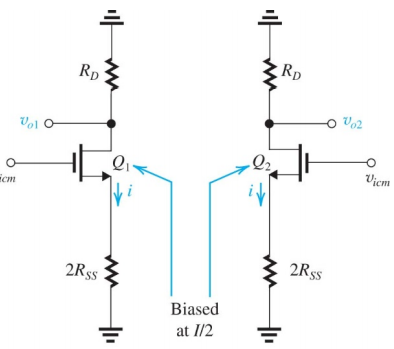

$$
\begin{gather}
|A_{cm}|=\frac{v_{o1}-v_{o2}}{v_{icm}}=0
\\\\
|A_{d}|=\frac{v_{o1}-v_{o2}}{v_{id}}=g_{m}R_{D}
\\\\
CMRR \equiv \left|\frac{A_{d}}{A_{cm}}\right|=\infty
\end{gather}
$$

- Effect of $R_{D}$ mismatch

$$
\begin{gather}
A_{cm} = -\frac{R_{D}}{2R_{SS}}\frac{\Delta R_{D}}{R_{D}}
\\\\
A_{d} \approx -g_{m}R_{D}
\\\\
CMRR = \left|\frac{A_{d}}{A_{cm}}\right|=\frac{2g_{m}R_{SS}}{\Delta R_{D}/R_{D}}
\end{gather}
$$

- Effect of $g_{m}$ mismatch ($W/L$ mismatch)

$$
\begin{gather}
A_{cm} = \frac{R_{D}}{2R_{SS}}\frac{\Delta g_{m}}{g_{m}}
\\\\
A_{d} = -g_{m}R_{D}
\end{gather}
$$
---

### BJT
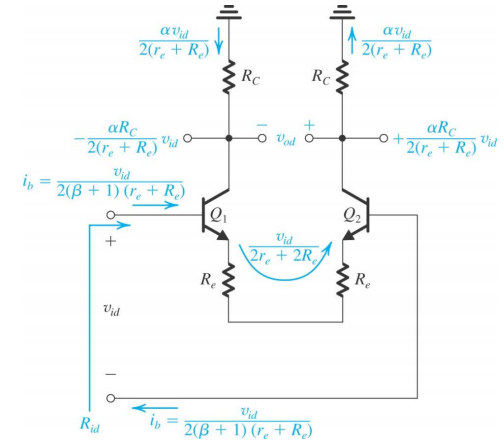

- $R_{id}$ (without $R_{e}$)

$$
\begin{gather}
R_{id }\equiv \frac{v_{id}}{ib} = (\beta+1)\ 2r_{e} = 2r_{\pi}
\end{gather}
$$

- $R_{id}$ (with $R_{e}$)
$$R_{id} \equiv \frac{v_{id}}{i_{b}}=(\beta +1)(2r_{e}+2R_{e})$$

- $R_{icm}$
$$
\begin{gather}
R_{icm}  \approx(\beta +1)(R_{EE} // \frac{r_{o}}{2})
\end{gather}
$$

#### single-end
$$
\begin{gather}
A_{cm} = -\frac{\alpha R_{C}}{2R_{EE}} \approx -\frac{R_{C}}{2R_{EE}}
\end{gather}
$$

#### differential-ended
- without ($R_{e}$)
$$
\begin{gather}
A_{cm} = \frac{v_{od}}{v_{icm}} = 0
\\\\
A_{d} = \frac{v_{od}}{v_{id}} =-g_{m}(R_{C}|| r_{o}) = -\frac{\alpha}{r_{e}}(R_{C}||r_{o})
\end{gather}
$$

- with ($R_{e}$)

$$
\begin{gather}
A_{cm} = \frac{v_{icm}}{v_{id}} = 0
\\\\
A_{d} = \frac{v_{od}}{v_{id}} = -\frac{\alpha}{r_{e}+R_{e}}(R_{c}||r_{o})
\end{gather}
$$

- $R_{C}$ mismatch

$$
\begin{gather}
A_{cm} = - \frac{R_{C}}{2R_{EE}}\frac{\Delta R_{C}}{R_{C}}
\end{gather}
$$

---

## DC offset

$$
\begin{gather}
V_{OS} \equiv \frac{v_{o}}{A_{d}}
\end{gather}
$$

### MOS

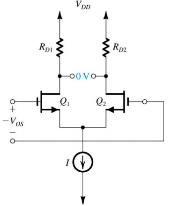

- Mismatch in load resistances

$$
\begin{gather}
V_{O}=V_{D2}-V_{D1}=\frac{I}{2}\Delta R_{D}
\\\\
V_{OS} = \frac{V_{O}}{g_{m}R_{D}}=\frac{V_{OV}}{2}\frac{\Delta R_{D}}{R_{D}}
\end{gather}
$$

- Mismatch in $W/L$

$$
\begin{gather}
V_{O} = \frac{I}{2}\ \frac{\Delta (\frac{W}{L})}{\frac{W}{L}}R_{D}
\\\\
V_{OS} = \frac{V_{O}}{g_{m}R_{D}}=\frac{V_{OV}}{2}
\frac{\Delta(\frac{W}{L})}{\frac{W}{L}}
\end{gather}
$$

- Mismatch in $V_{t}$

$$
\begin{gather}
V_{O} = I\ \frac{\Delta V_{t}}{V_{OV}} R_{D}
\\\\
V_{OS} = \frac{V_{O}}{g_{m} R_{D}} = \Delta V_{t}
\end{gather}
$$

- Total offset

$$
\begin{gather}
V_{OS} = \sqrt{\left(\frac{V_{OV}}{2}\frac{\Delta R_{D}}{R_{D}}\right)^{2}+\left(\frac{V_{OV}}{2}
\frac{\Delta(\frac{W}{L})}{\frac{W}{L}}\right)^{2}+\left(\Delta V_{t}\right)^{2}}
\end{gather}
$$

---

### BJT

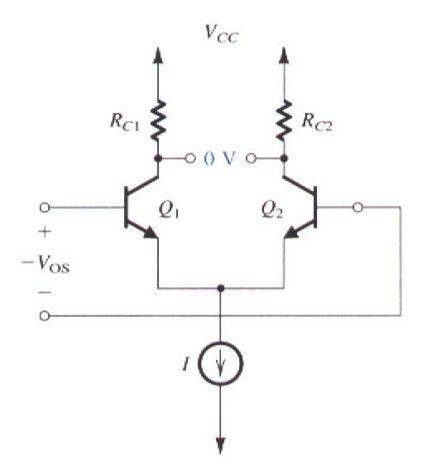

- $A_{d} = g_{m}R_{C}$
- $g_{m} = \frac{I_{C}}{V_{T}}=\frac{\alpha I}{2V_{T}}$

- mismatch in load resistances

$$
\begin{gather}
V_{O}=V_{C2}-V_{C1}=\alpha \frac{I}{2}\Delta R_{C}
\\\\
V_{OS} = \frac{\alpha\frac{I}{2}\Delta R_{C}}{g_{m} R_{C}}=V_{T}\frac{\Delta R_{C}}{R_{C}}
\\\\
\end{gather}
$$

- Mismatch in EBJ areas

$$
\begin{gather}
V_{O} = \alpha \frac{I}{2} \frac{\Delta I_{S}}{I_{S}}
\\\\
V_{OS} = V_{T}\frac{\Delta I_{S}}{I_{S}}
\end{gather}
$$

- Total Mismatch

$$
\begin{gather}
V_{OS} = \sqrt{\left(V_{T}\frac{\Delta R_{C}}{R_{C}}\right)^{2}+\left(V_{T}\frac{\Delta I_{S}}{I_{S}}\right)^{2}}
\end{gather}
$$

#### Input Bias and Offset Currents

$$
\begin{gather}
I_{B1} = I_{B} - I_{OS}
\\\\
I_{B2} = I_{B} + I_{OS}
\end{gather}
$$

- Mismatch $\beta$

$$
\begin{gather}
I_{B} = \frac{I/2}{\beta + 1}
\\\\
I_{OS} = \frac{I}{2(\beta+1)}\frac{\Delta\beta}{\beta}=I_{B} \frac{\Delta\beta}{\beta}
\end{gather}
$$

---
## Differential Amp. with Current-Mirror Load
### MOS

#### Differential gain
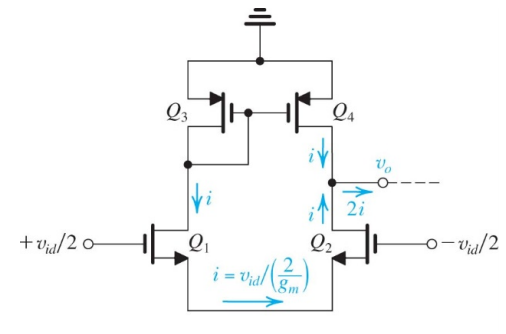

$$
\begin{gather}
v_{o} = i_{sh}\ R_{o}
\\\\
i_{sh} = 2i=2\cdot\frac{1}{2}v_{id}\ g_{m}
\\\\
R_{o2} = r_{o2}+\frac{1}{g_{m1}}(1+g_{m2}r_{o2}) \approx2r_{o2}
\\\\
R_{o} = (2r_{o2} || 2r_{o2} || r_{o4}) = r_{o2} || r_{o4}
\\\\
G_{m} = g_{m1, 2}=g_{m}
\\\\
A_{d} = \frac{v_{o}}{v_{id}}=G_{m}R_{o}=g_{m}(r_{o2}||r_{o4})=\frac{1}{2}g_{m}r_{o}=\frac{1}{2}A_{o}
\\\\
A_{cm} = -\frac{1}{2g_{m3}R_{SS}}
\end{gather}
$$
abc efg
where $A_{o}$ is the instrinsic gain of the MOS.

### BJT
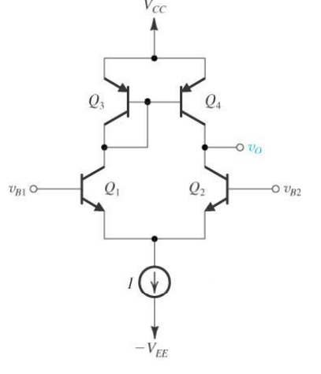

- same as MOS except $R_{id}$
$$
\begin{gather}
G_{m} = g_{m1, 2}=g_{m}
\\\\
R_{o2} = r_{o2} + (r_{e1} || r_{\pi 2})(1+g_{m2}r_{o2}) \approx 2r_{o2}
\\\\
R_{o}=r_{o2}||r_{o4}
\\\\
A_{d}=\frac{v_{o}}{v_{id}}=G_{m}R_{o}=g_{m}(r_{o2}||r_{o4})
\\\\
R_{id}=2r_{\pi}
\end{gather}
$$

---

## Common-Mode Gain

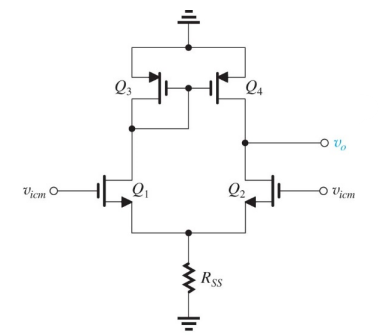

$$
\begin{gather}
A_{cm} = G_{mcm}R_{om}

\\\\
G_{mcm} = \frac{1}{2R_{SS}}
\\\\
R_o = r_{o2} || r_{o4}
\\\\
A_{d} = G_{m} R_{o} = g_{m} R_{o}
\\\\
A_{cm} = - \frac{1}{2g_{m3}R_{SS}}\frac{r_{o4}}{r_{o3}} \approx \frac{1}{2g_{m3}R_{SS}}

\end{gather}
$$