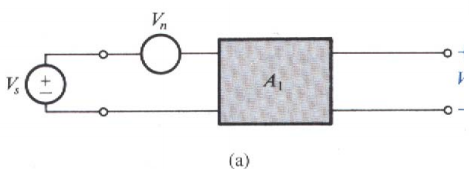
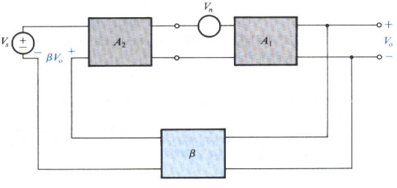
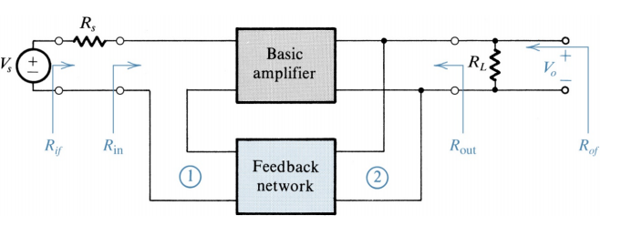

## Negative Feedback

- open loop gain: $A$
- Loop Gain: $A\beta$
- Amount of feedback $1+A\beta$
- close loop gain: $A_{f} = \frac{x_{0}}{x_{s}} = \frac{A}{1+A\beta}$
- $x_{f} = \beta \ x_{0}$
- Feedback signal: $x_{f} = \frac{A\beta }{1+A\beta}x_{s}$
- $$x_{i} = \frac{1}{1+A\beta}x_{s}$$

- $$
  \frac{dA_{f}}{A_{f}}=\frac{1}{1+A\beta}\frac{dA}{A}
  $$

### Bandwidth
$$
\begin{gather}
A(s) = \frac{A_{M}}{1+s/\omega_{H}}
\\\\
A_{f}(s) = \frac{A(s)}{1+\beta A(s)} = \frac{\frac{A_{M}}{1+A_{M}\beta}}{1+s/(\omega_{H}(1+A_{M}\beta))}
\\\\
\omega_{HF} = \omega_{H}(1+A_{M}\beta)
\end{gather}
$$

### Noise

$$
\begin{gather}
\frac{S}{N} = \frac{V_{s}}{V_{n}}
\end{gather}
$$

---

$$
\begin{gather}
\frac{S}{N} = \frac{V_{s}}{V_{n}}A_{2}
\end{gather}
$$

---

## series-shunt

- input
$$
\begin{gather}
R_{if} = R_{in} + R_{s}
\\\\
R_{if} = R_{i} (1+\beta A)
\end{gather}
$$

- output

$$
\begin{gather}
R_{of} = R_{out} || R_{L}
\\\\
R_{of} = \frac{R_{o}}{1+\beta A}
\end{gather}
$$

- 沒有 $R_{s}$ 的情況，$R_{in} = R_{if}$
- 沒有 $R_{L}$ 的情況，$R_{out} = R_{of}$