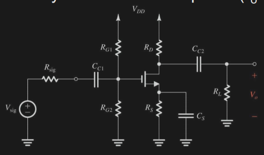
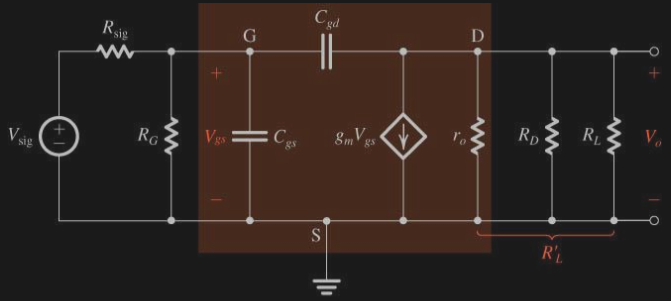
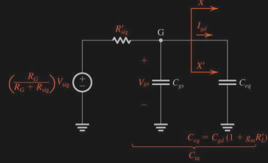
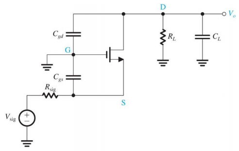
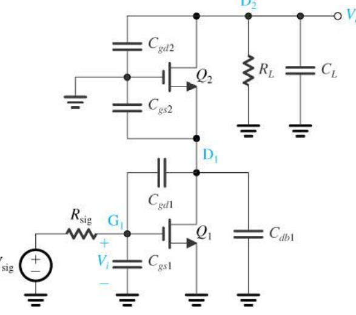
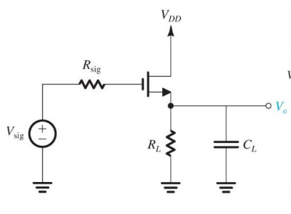

## low freq. response

### CS

- 先分成三項： 
$$\frac{V_{o}}{V_{sig}}=\frac{V_{g}}{V_{sig}}\frac{I_{d}}{V_{g}}\frac{V_{o}}{I_{d}}$$

$$
\begin{gather}
\frac{V_{g}}{V_{sig}} = \frac{\text{放大率}}{1+\text{pole}}=\frac{\frac{R_{G}}{R_{G}+R_{sig}}}{1+\frac{\omega_{p1}}{j\omega}}
\\\\
\tau_{p1}= C_{1}(R_{G}+R_{si})
\\\\
\frac{I_{d}}{V_{g}} = \frac{s+\omega_{z}}{s+\omega_{p2}} = g_{m}\frac{s+\frac{1}{R_{S}C_{S}}}{s+\omega_{p2}}
\\\\
\tau_{p2} = C_{S} (R_{S}||\frac{1}{g_{m}})
\\\\
\frac{V_{o}}{I_{d}} = \frac{\text{放大率}}{1+\text{pole}} = \frac{-(R_{D}||R_{L})}{1+\frac{\omega_{p3}}{j\omega}}
\\\\
\tau_{p3} = C_{C2}\ (R_{D} + R_{L})
\end{gather}
$$

### 3dB pole 
- $\omega_{L}$

- $\omega_{L}$ 會很靠近最大的 pole
- $\omega_{L} \approx \omega_{p1} + \omega_{p2} + \omega_{p3} \approx \omega_{p2}$ （假設 $\omega_{p2}$ 是最大的 pole）

---

## High Freq.

### CS

- 考慮 $C_{gd}, C_{gs}$ 求 $V_{o}$
- 求 upper 3-dB frequency $f_{H}$

可求得等效電路圖

- $C_{eq} = C_{gd}(1+g_{m}R_{L}')$,   (Miller Effect)
- $C_{in} = C_{eq} + C_{gs} = C_{gs} + (1+g_{m}R_{L}')C_{gd}$
- $\omega_{H} = \omega_{0} = \frac{1}{C_{in}R_{sig}'}$

- 從 $C_{gd}$ 流過的電流叫做 $I$
- Assume $I << g_{m}V_{gs} \implies V_{o} \approx -g_{m} V_{gs} R_{L}'$，否則會有兩個 pole 出現。

$$
\begin{gather}
V_{gs} = \left(\frac{R_{G}}{R_{G}+R_{sig}}V_{sig}\right) \frac{1}{1+\frac{s}{\omega_{o}}}
\\\\
\frac{V_{o}}{V_{sig}} = - \left(\frac{R_{G}}{R_{G}+R_{sig}}V_{sig}\right)\ (g_{m}R_{L}')\ \frac{1}{1+\frac{s}{\omega_{o}}}= \frac{A_{M}}{1+\frac{s}{\omega_{o}}}
\end{gather}
$$

#### Unity-Gain Freq. 

- $f_{T}$

- 找頻寬最寬的時候（發生在放大倍率最小的時候）
- 放大倍率為 : $g_{m}(r_{o} || R_{D})$, $R_{D}$ 開路,  short $D$ and $S$ 則 $r_{o}$短路放大率為 0
- **definition** : short circuit 時的 current gain = 1 時的 frequency.

$$
\begin{gather}
\frac{I_{o}}{I_{i}} = \frac{g_{m}}{s(C_{gs}+G_{gd})}
\\\\
\left|\frac{I_{o}}{I_{i}}\right| =1 \implies \omega_{T} = \frac{g_{m}}{C_{gs}+C_{gd}}
\\\\
f_{T} = \frac{g_{m}}{2\pi(C_{gs} + C_{gd})}
\end{gather}
$$

- 也可以用 $f_{T} = |A_{M}|\ f_{H}$ 來找

---

#### 3dB pole

- 和 low frequency 相反，$\tau_{H} = \tau_{p1} + \tau_{p2} + \dots$

- 不考慮 $C_{L}$
$$
\begin{gather}
\tau_{H} = C_{in}R_{sig}'=(C_{gs}+C_{gd}(1+g_{m}R_{L}'))R_{sig}'
\end{gather}
$$

- 以放大電容角度看 (aka **Miller effect method**)
$$
\begin{gather}
\tau_{H} = \big(C_{gs}+C_{gd}(1+g_{m}R_{L}'))R_{sig}'+(C_{gd}+C_{L})R_{L}'
\end{gather}
$$

- 以放大電阻角度看 (aka Method of **open-circuit time constant**)

$$
\begin{gather}
\tau_{H} = C_{gs}R_{sig}' +C_{gd}\big(R_{sig}'(1+g_{m}R_{L}')+R_{L}'\big)+C_{L}R_{L}'
\end{gather}
$$

- assume $R_{sig}$ is very low, find $f_{H}$

$$
\begin{gather}
\tau_{H} = R_{L}'(C_{gd}+C_{L})
\\\\
f_{H} = \frac{1}{2\pi \ R_{L}'(C_{gd}+C_{L})}
\end{gather}
$$

#### zero

- by definition 
$$\frac{V_{out}(s_{z})}{V_{in}(s_{z})}=0$$

- 解得
$$
\begin{gather}
V_{gs}C_{gd}s_{z}= g_{m}V_{gs}
\\\\
\omega_{z} = \frac{g_{m}}{C_{gd}}
\end{gather}
$$

---
### CG

- $R_{in} = \frac{r_{o}+R_{L}}{1+g_{m}r_{o}}$
- $R_{out} = r_{o} + R_{sig}(1+g_{m}r_{o})$
$$
\begin{align}
\tau_{H} &= \tau_{gs} + \tau_{gd}
\\\\
&= C_{gs}(R_{sig} || R_{in}) + (C_{gd}+C_{L})(R_{L} || R_{out})
\end{align}
$$

### Cascode

- $R_{in2} = \frac{r_{o2}+R_{L}}{1+g_{m2}r_{o2}}$
- $R_{d1} = r_{o1} || R_{in2}$
- $R_{out} = r_{o2}+r_{o1}(1+g_{m2}r_{o2})$

$$
\begin{align}
\tau_{H} = & C_{gs1}R_{sig}
\\\\
&+C_{gd1}\big(R_{sig}(1+g_{m1}R_{d1})+R_{d1}\big)
\\\\
&+(C_{db1}+C_{gs2})R_{d1}
\\\\
&+(C_{gd2}+C_{L})(R_{L} || R_{out})
\end{align}
$$

- take very small $R_{sig}$ and $R_{d1}$

$$
\begin{gather}
\tau_{H} = (C_{gd2}+C_{L})(R_{L}||R_{out})
\end{gather}
$$

- $f_{t} = |A_{M}| f_{H}$

$$
\begin{align}
f_{t} &= g_{m2}(R_{L}||R_{out})f_{H}
\\\\
&= \frac{1}{2\pi}\frac{g_{m}}{C_{L}+C_{gd2}}
\end{align}
$$

### CD

$$
\begin{gather}
\frac{V_{o}}{V_{sig}} = A_{M}\frac{1+\frac{s}{\omega_{z}}}{1+b_{1}s+b_{2}s^{2}}
\\\\
A_{M} = \frac{R_{L}'}{R_{L}'+\frac{1}{g_{m}}}
\\\\
b_{1} = C_{gd}R_{sig}+C_{gs}\frac{R_{L}'+R_{sig}}{1+g_{m}R_{L}'}+C_{C_{L}}(R_{L}'||\frac{1}{g_{m}})
\\\\
b_{2} = \frac{R_{sig}R_{L}'(C_{gd}C_{L}+C_{gs}C_{L}+C_{gs}C_{gd})}{1+g_{m}R_{L}'}
\end{gather}
$$

#### zero 
- 跟 CS 相反，CS是 $C_{gd}$，CD是 $C_{gs}$

$$
\begin{gather}
\omega_{z} = \frac{g_{m}}{C_{gs}}
\end{gather}
$$

#### 3dB pole

- $\tau_{p1} = b_{1}$

$$
\begin{gather}
f_{H} = \frac{1}{2\pi\ b_{1}}
\end{gather}
$$

#### Q-factor

$$
\begin{gather}
Q = \frac{\sqrt{b_{2}}}{b_{1}}
\end{gather}
$$