## (0) Data Preprocessing

The dataset is split into $80\%$ training and $20\%$ testing in a stratified fashion. In addition, the field *Time* is scaled to $[0, 1]$, and the rest are standardized.

## (i) LR, SVM, and RF

### Logistic Regression

Logistic regression is similar to linear regression but outputs with sigmoid function to map the range to $[0, 1]$. That is

$$
P(y \mid x) = \frac{1}{1+ \exp (-w^T x)}
$$

### SVM

SVM (Support Vector Machine) try to separate data using hyperplane and maximize the margin between the support vectors.
Note that the SVM can actually adopt non-linear kernel instead of hyperplane.

### Random Forest

Random forest is the combination of *bagging* and *decision tree*, taking the advantage of both of them.

Decision tree without limitation on the depth of trees can aggregate any dataset but may introduce high variance i.e. severe overfitting.
However, by growing trees using bootstrapped datasets, the variance can be reduced.

## (ii) Confusion Matrices

|     |                                                                 |
| --- | --------------------------------------------------------------- |
| LR  |     |
| SVM | 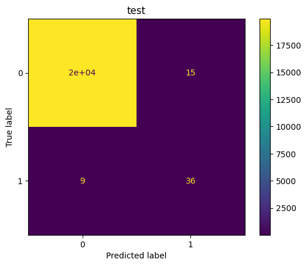 |
| RF  |     |
| DNN | 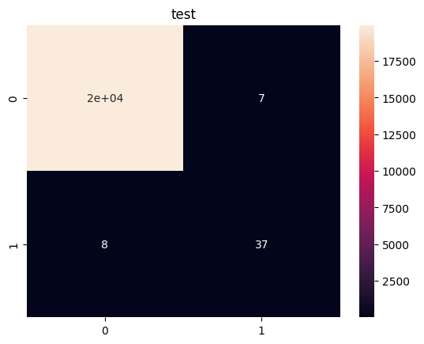        |

## (iii) Precision, Recall, F1-score

In this dataset, accuracy is definitely not suitable due to the high imbalance.

Therefore, precision and recall are more suitable metrics and both of them are important.

If false positives cannot be tolerated, precision would be more important than recall. On the other hand, if we want to retrieve all true positives, then recall would be more important.

Therefore, without context, F1-score is a more suitable metric.

- The table shows metrics for label $1$ using test set

|     | Precision | Recall | F1-score | AUROC | AUPRC |
| --- | --------- | ------ | -------- | ----- | ----- |
| LR  | 0.70      | 0.62   | 0.66     | 0.95  | 0.72  |
| SVM | 0.71      | 0.80   | 0.75     | 0.98  | 0.69  |
| RF  | 0.95      | 0.80   | 0.87     | 0.95  | 0.89  |
| DNN | 0.84      | 0.82   | 0.83     | 0.97  | 0.59  |

## (iv) DNN

The grid search is performed through cross validation on f1 score using $0.5$ as threshold. The searched domain is shown as following:

- \#hidden: $\set{32, 64, 128}$
- \#layers: $\set{2, 4, 8}$
- epochs: $\set{20, 50, 80}$
- batch_size: $\set{32, 512, 4096}$
- learning_rate: $\set{10^{-3}}$

Here is the optimal hyperparameters with mean cross validation f1-score $0.829$
- \#hidden=$128$,  \#layers=$2$, epochs=$50$, batch_size=$512$, learning_rate=$10^{-3}$

|                                                          |                                                          |
| -------------------------------------------------------- | -------------------------------------------------------- |
| 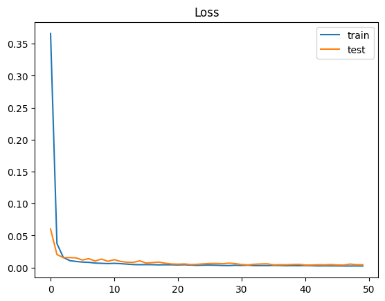 | 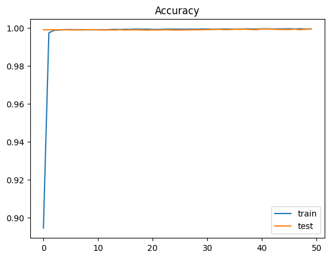 |

As for the loss and accuracy, you can observe both of them on both train and test set seem to perform very well. However, these results are actually misleading because the negative samples are overwhelmingly more than positive samples.

---

## (v) ROC, PRC

|     | ROC                                                      | PRC                                                      |
| --- | -------------------------------------------------------- | -------------------------------------------------------- |
| LR  | 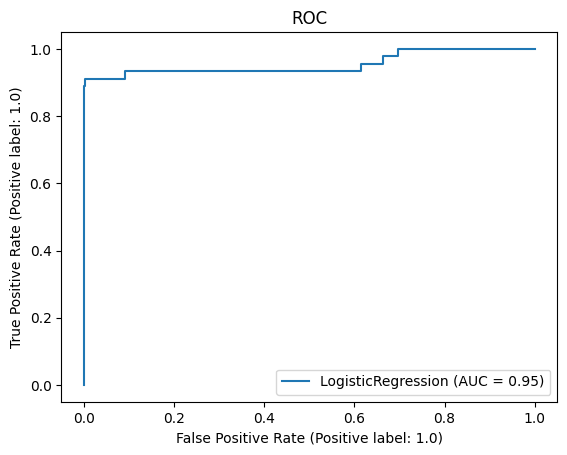 | 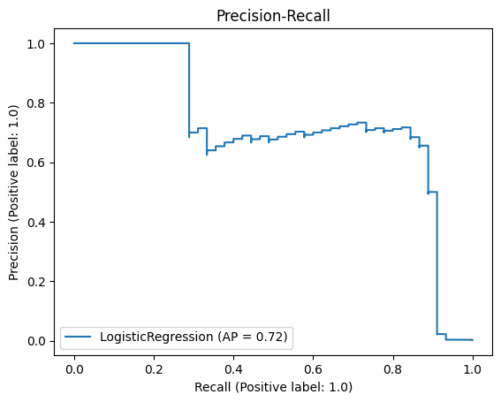 |
| SVM | 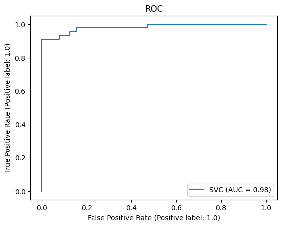 | 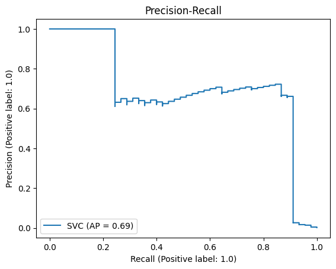 |
| RF  | 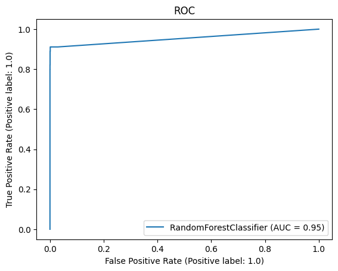 | 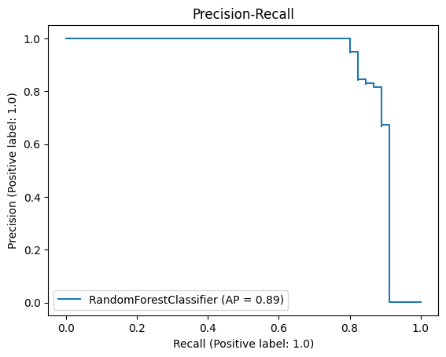 |
| DNN | 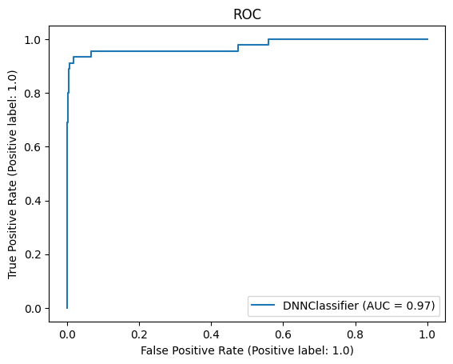 | 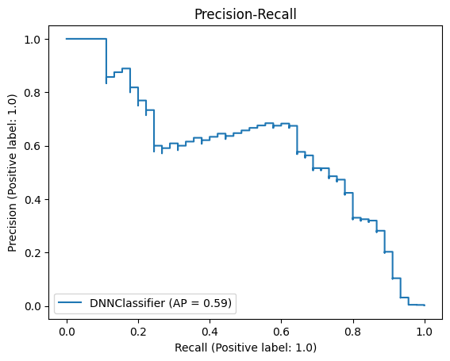 |

The confusion tables and metrics of DNN have shown in the previous table.

## (vi) Briefly describe what your found

The table shows RF outperforms the rest models in term of both F1-score and AUPRC.
Following RF, DNN reaches $0.83$ f1-score, which is slightly less than the f1-score of RF $0.87$. Although a grid search has been performed, the design space of DNN is actually very large and may perform better than RF if well designed.

SVM is in the third place, only better than the simplest model LR. However, I used linear kernel for the SVM model. It is likely that SVM performs better if non-linear kernel is used. Nevertheless, I use the linear kernel for faster computation.

## (vii) Dataset Imbalance

The dataset is very imbalanced as the positive samples are only $0.2\%$ of total samples

| Undersampling | Precision | Recall | F1-score | AUROC | AUPRC |
| ------------- | --------- | ------ | -------- | ----- | ----- |
| LR            | 0.09      | 0.91   | 0.16     | 0.98  | 0.48  |
| SVM           | 0.05      | 0.91   | 0.09     | 0.98  | 0.52  |
| RF            | 0.09      | 0.93   | 0.17     | 0.98  | 0.62  |
| DNN           | 0.08      | 0.91   | 0.15     | 0.98  | 0.56 |

The performance of models drop significantly using 50%/50% under-sampling method according to F1-score. However, the recall rates actually increase, and the F1-scores are low due to the very low precision rates.
This shows under-sampling does help models to learn from minor-class samples. Nevertheless, it deleted too many samples from our datasets, making the under-sampled dataset contains too small for training ML/DL models. In our case, the under-sampled dataset contains only $10k \times 0.8 \times 0.2\% \times 2 \approx 356$.

## (viii) Other methods deal with imbalanced data

One of the wide-known methods tackling imbalanced data except for over- and under-sampling is using class-weights.

For example, in the case of DNN, we can introduce class-weights to the loss function as

$$
L_{cw} = - w_0 y(\log \hat{y}) - w_1 (1-y) (\log (1-\hat{y}))
$$

Generally, higher weight for minor class would increase recall rate, but may slightly decrease precision rate.

Optimal class-weights can be found using cross validation, although here I simply used $1:5$ for experiment.

| Class-weight ($1:5$) | Precision | Recall | F1-score | AUROC | AUPRC |
| ---------------------- | --------- | ------ | -------- | ----- | ----- |
| LR                     | 0.76      | 0.84   | 0.80     | 0.98  | 0.69  |
| SVM                    | 0.70      | 0.84   | 0.77     | 0.99  | 0.68  |
| RF                     | 0.97      | 0.82   | 0.89     | 0.97  | 0.91  |
| DNN                    | 0.73      | 0.91   | 0.81     | 0.97  | 0.77  |

The results demonstrate the effectiveness of the simple method class-weighting. Except for DNN, all models improve in term of F1-scores.