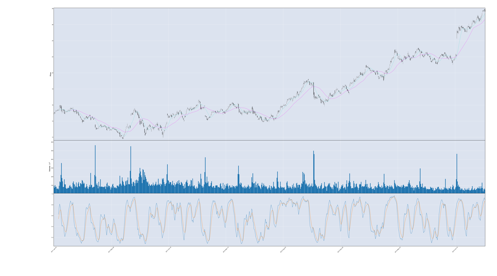
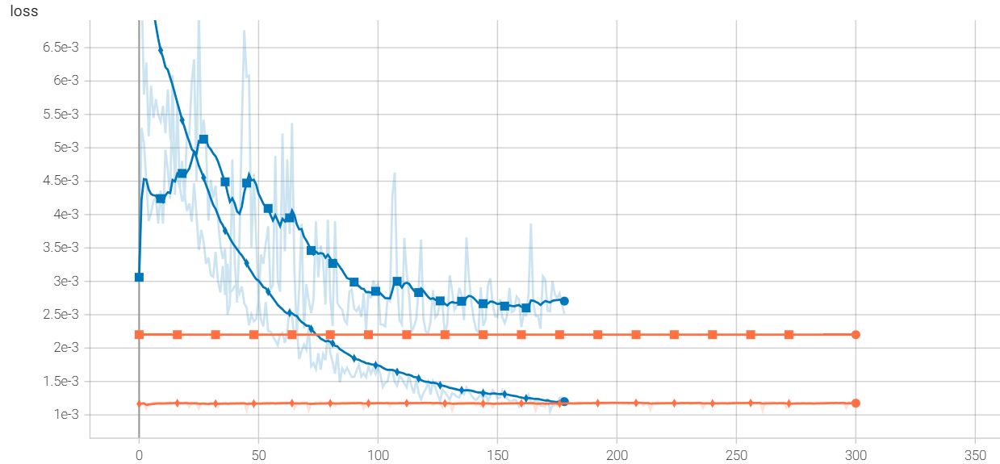
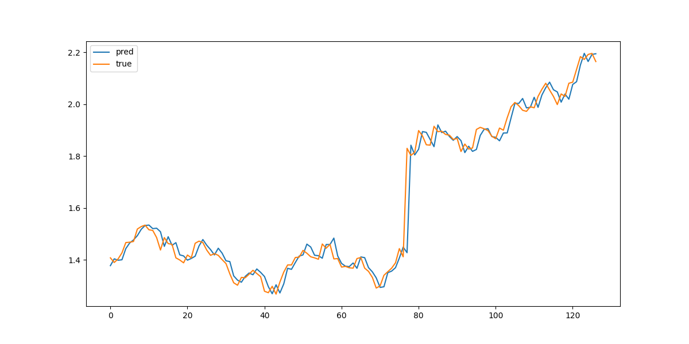
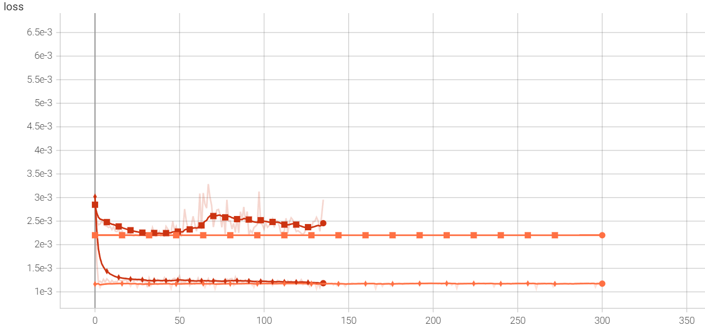
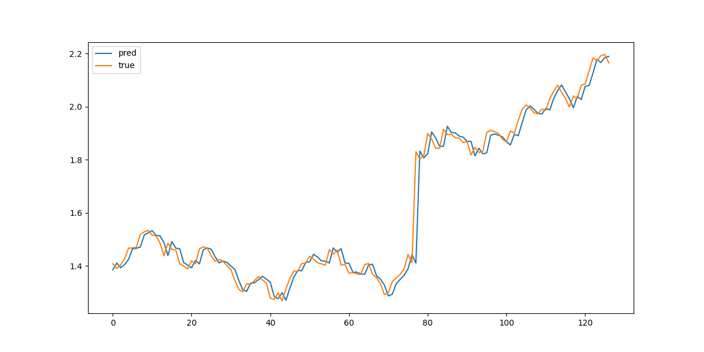
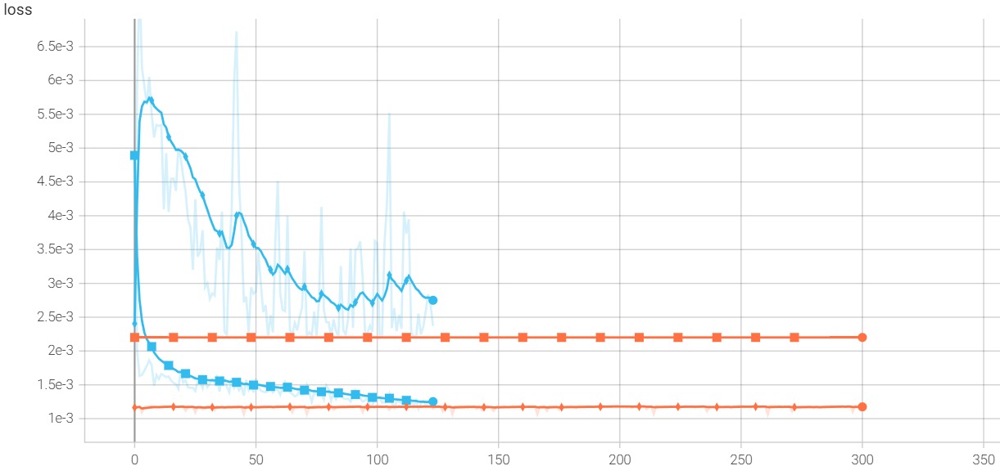

## (i) Charts

Figure0. From top to bottom: Candlestick, Volume, KD chart

## (ii) Preprocessing

During preprocessing, I added K, D, MA3, MA10, and MA30 as new features. Furthermore, week days derived from the timestamp are also added in one-hot encoding.

As for the prediction target *Close*, it was preprocessed to be *Close_Delta*, so that model only need to predict the relative change of *Close*, which should be a easier task for RNN models.

## (iii), (iv) Designing RNNs

A sample for RNN models is represented as $x_{1:30} = (x_1, \dots, x_{30}) \in \mathbf R^{30 \times d_f}$,  where $x_t \in \mathbf R^{d_f}$ is a row from the original table, and $d_f$ is the dimension of features.

The model architecture can be summarized as:

$$
\begin{gather}
o_{1:30} \leftarrow \text{RNN}(x_{1:30})
\\\\
\hat y \leftarrow \text{head}(\text{fusion}(o_{1:30}))
\end{gather}
$$

where $\text{RNN}$ can be one of vanilla RNN, LSTM, and GRU, its output dimension is set the same as hidden dimension, i.e. $o_{1:30} \in \mathbf R^{30 \times d_h}$, where $d_h$ is the hidden dimension.

The outputs then will be fused and the $\text{head}$ is a linear layer serving as the final regressor.

As for $\text{fusion}$, I have tried one of the following:

- *last*: simply take the last outputs. $\text{fusion}(o_{1:30}) = o_{30}$
- *mean*: average the outputs. $\text{fusion}(o_{1:30}) = \frac{1}{30}\sum\limits_{t=1}^{30} o_{t}$
- *weighted_sum*: similar to *mean*, but use learnable weights $\text{fusion}(o_{1:30}) = \sum\limits_{t=1}^{30} w_t o_{t}$ (where $w_1 + \dots + w_{30} = 1$)
- *concat*: Concatenate all the outputs $\text{fusion}(o_{1:30}) = o_1 \oplus \dots \oplus o_{30}$

After some experiments, *concat* tends to result in better performance. Thus, the following experiments are conducted using *concat* as the fusion.

Furthermore, in order to better compare the performance of the RNN models, I developed a baseline model that always predicts using the "Close" of the last day. The prediction curve by baseline can be found in the discussion section (Figure7).

## (v) Vanilla RNN

|                                                                |
| -------------------------------------------------------------------------------------------------------------------------- |
| Figure1. Loss curves for vanilla RNN (train in diamonds, test in squares; blue curves for RNN, orange curves for baseline) |

|      |
| ---------------------------------------------------------------- |
| Figure2. Prediction of "Close" value in test part by vanilla RNN |

## (vi) LSTM

|                                                           |
| ------------------------------------------------------------------------------------------------------------------ |
| Figure3. Loss curves for LSTM (train in diamonds, test in squares; red curves for RNN, orange curves for baseline) |

|  |
| --------------------------------------------------------- |
| Figure4. Prediction of "Close" value in test part by LSTM |

## (vii) GRU

|                                                            |
| ------------------------------------------------------------------------------------------------------------------ |
| Figure5. Loss curves for GRU (train in diamonds, test in squares; blue curves for RNN, orange curves for baseline) |

|  |
| -------------------------------------------------------- |
| Figure6. Prediction of "Close" value in test part by GRU |

## (viii) Discussion

|  |
| ------------------------------------------------------------- |
| Figure7. Prediction of "Close" value in test part by baseline |

|            | Vanilla | LSTM   | GRU    | Baseline |
| ---------- | ------- | ------ | ------ | -------- |
| epoch      | 128     | 85     | 73     | -        |
| loss/train | 0.0013  | 0.0012 | 0.0016 | 0.0011   |
| loss/valid | 0.0012  | 0.0011 | 0.0011 | 0.0012   |
| loss/test  | 0.0022  | 0.0023 | 0.0022 | 0.0022   |
| acc/train  | 0.5474  | 0.4935 | 0.5388 | 0.4935   |
| acc/valid  | 0.5242  | 0.5000 | 0.5323 | 0.4758   |
| acc/test   | 0.5039  | 0.4646 | 0.4803 | 0.5197   |

Here I introduce a more human-interpretable metric *acc*(accuracy) that describes the ratio of correctly predicting the "Close" value go up or go down.

All the three models are early-stopped with threshold 50 epochs. The table above reports the best results according to validation loss.

The results show all three models are not better than the simple baseline w.r.t. testing loss. In response to the results, I made some assumptions that may explain the experimental results

### Assumption 1: RNNs are not complex/strong enough to model our data

This assumption can be quickly rejected, for the RNNs are observed performing well on training split. If the early stopping thresholds are set longer, the *acc/train* can grow over $60\%$ while *acc/test* dropping below $40\%$.

### Assumption 2: RNNs have too much parameters resulting in large generalization error

After some extra experiments trying less complicated RNNs and incorporating regularization, I found the models those are less complicated have problem minimizing training error.

Therefore, I believe this assumption is likely to be false.

### Assumption 3: Large distribution difference between train split and test split

The basic assumption for DL models is that training samples and testing should be drawn from same distribution.

However, according to the candlestick chart in *Figure0*, During the training period, the prices were fluctuating around $15$ dollars.
On the other hand, during testing period, the prices raised over $25\%$ in a short period, which was not observed during whole training period.

Although the RNN models are expected to capture some fluctuation patterns given the information, behaviors of investors are likely to change during bull market. This could explain the experimental result.

To address this problem, there may be some potential solutions. Firstly, with more data that can be used for training RNN, the RNNs are more likely to generalize over time. Here more data means we either have more trading data from different stocks, or extend the period for training, or both.

The second potential solution is leveraging real-world event information, e.g. financial news.
