## (i) Preprocessing & EDA

### Dataset Reduction

It's observed in the original dataset $\mathcal D$, there are a lot of identical samples with different labels.

To make the training more efficient, I merge those duplicated samples. All samples in the new reduced dataset $\tilde{\mathcal D}$  are unique, and they are labeled by the mean of original labels.

That is,
$$
\begin{gather}
\tilde {\mathcal D} = \set{\big(x, P_{\mathcal D}(y = 1\mid x)\big) \mid (x, y) \in \mathcal D},
\end{gather}
$$

where $x \in \mathbf R^d, y \in \set{0, 1}$.

To remain the sample distribution of the reduced dataset $\tilde {\mathcal D}$, I simply maintain the probability of samples being drawn with the that of the original dataset $\mathcal D$.

$$
\begin{gather}
P_{\tilde {\mathcal D}}(x) = P_{\mathcal D}(x)
\end{gather}
$$
In practice, this is achieved via setting sample weights while calculating losses.

### Data Imbalanced & Oversampling

The labels of the datasets is observed very imbalanced. There are only $1.1\%$ positive samples in the training split of original dataset $\mathcal D$.

However, the mean of $y$ in the uniform sampled reduced dataset $\tilde{\mathcal D}$ equals $0.235$ on training split.

|            | $P_{\mathcal D}(y=1)$ | $\text{mean}(\set{y \mid (x, y) \in \tilde {\mathcal D}})$ |
| ---------- | --------------------- | ---------------------------------------------------------- |
| train      | 1.1%                  | 0.235                                                      |
| validation | 0.8%                  | 0.122                                                      |
| test       | 1.1%                  | 0.102                                                      |

The mean values of $\tilde{\mathcal D}$ are much greater than the positive ratio of $\mathcal D$ is because most of the samples in $\mathcal D$ have empty browsing history and are not clicked.

There is a hyperparameter positive weight $w_p \in \mathbf R$. The samples in $\tilde{\mathcal D}$ are randomly drawn with weights $w=1+y(w_p-1)$. When $w_p > 1$, it is effectively oversampling; when $w_p < 1$, it's effectively undersampling.

### t-SNE

The t-SNE of the training split of the dataset $\mathcal D$ is plotted as

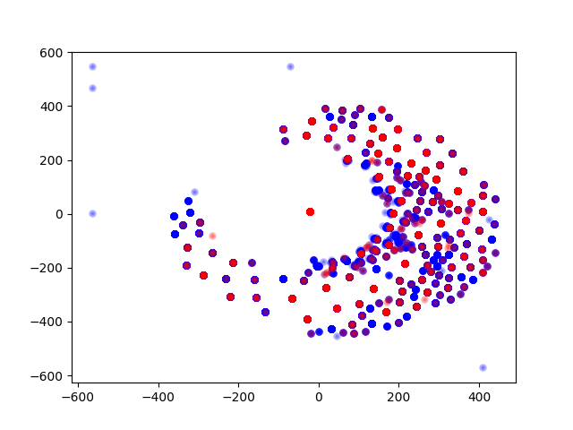

In the figure, the blue dots and red dots are negative and positive samples, respectively. As shown in the figure, a lots of samples overlapped with different colors, indicating that it's common to have multiple identical samples labelled differently.

---

## (ii) Model Design

A sample is represented as $x_{1:N+1} = (x_1, \dots, x_{N+1}) \in \set{0, 1}^{(N+1) \times d_f}$, where $d_f$ is the dimension of one-hot encoded features, $x_1$ is the target features of target news, $x_{2:N+1}$ are the browsing histories, and $N$ is the length of historical histories used as features, which will be further discussed in the section [(viii) Length of Sequences](#(viii)%20Length%20of%20Sequences).

The features are first passed through an embedding layer, and are then fed into a seq2seq model which is either bidirectional RNN model or transformer:

$$
\begin{gather}
e_i \leftarrow \sigma(\text{Linear}(x_i)), \quad \text{for } i=1, \dots, N+1
\\\\
o_{1:N+1} \leftarrow \text{Seq2Seq}(e_{1:N+1})
\end{gather}
$$
The output embedding $o_{1:N+1}$ are then used to predict the probability of the target news being clicked $\hat y$, i.e.
$$
\begin{gather}
\hat y \leftarrow \text{sigmoid}(\text{head}(\text{fusion}(o_{1:30}))).
\end{gather}
$$
Here, the predicting head is a simple linear layer while the fusion is one of the following:

- *first*: simply take the first outputs. $\text{fusion}(o_{1:N+1}) = o_{1}$
- *mean*: average the outputs. $\text{fusion}(o_{1:N+1}) = \frac{1}{N+1}\sum\limits_{t=1}^{N+1} o_{t}$
- *weighted_sum*: similar to *mean*, but use learnable weights $\text{fusion}(o_{1:N+1}) = \sum\limits_{t=1}^{N+1} w_t o_{t}$ (where $w_1 + \dots + w_{N+1} = 1$)
- *concat*: Concatenate all the outputs $\text{fusion}(o_{1:N+1}) = o_1 \oplus \dots \oplus o_{N+1}$

The experiments results show *concat* tend to work better with shallow Seq2Seq model, whereas *first* is slightly better while the model deeper.

## (iii) Loss Curves

In the figures, you can observe the curves of training loss damp dramatically. This is because the training losses are calculated on the reduced training set $\tilde{\mathcal D}_{\text{trian}}$ which contains only $726$ samples while $1024$ samples are trained within an epoch.

| 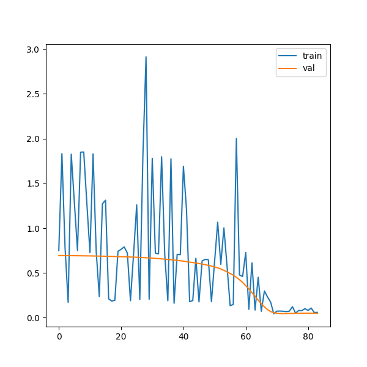 |
| -------------------------------------------------------- |
| Fig1.(a) Loss curves for LSTM                            |

| 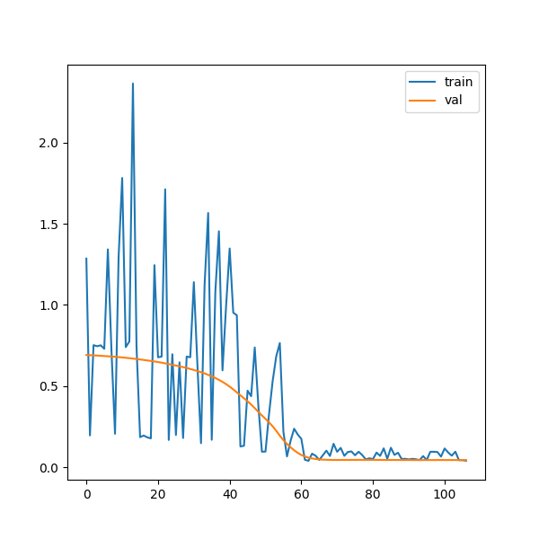 |
| -------------------------------------------------------- |
| Fig1.(b) Loss curves of GRU                              |

| 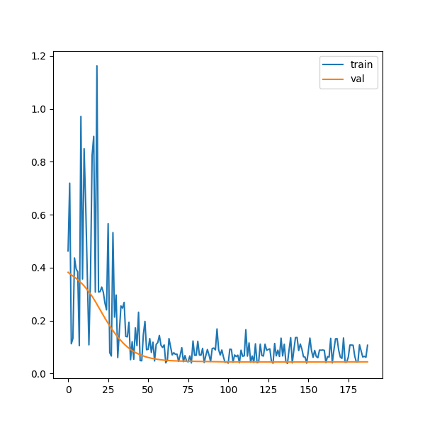 |
| -------------------------------------------------------- |
| Fig1.(c) Loss curves of Transformer                      |

## (iv)~(vi) AUROC, AUPRC

| 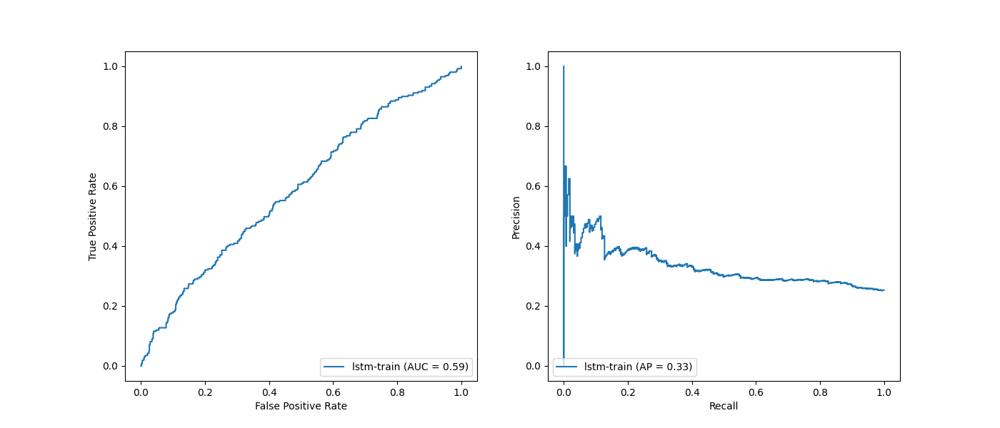 |
| -------------------------------------------------------- |
| Fig2. (a) ROC, PRC for LSTM on training                              |

| 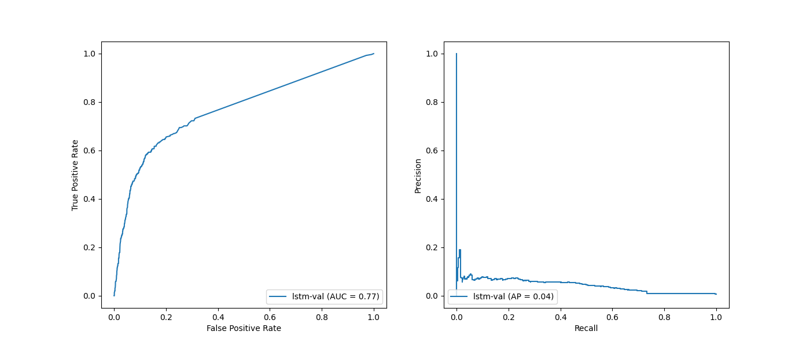 |
| -------------------------------------------------------- |
| Fig2. (b) ROC, PRC for LSTM on validation                |

| 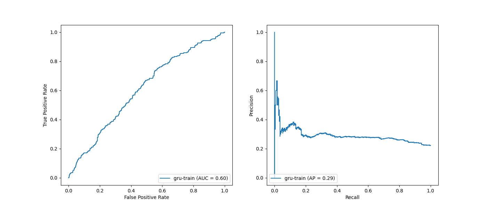 |
| -------------------------------------------------------- |
| Fig2.   (c) ROC, RPC, for GRU on training                |

| 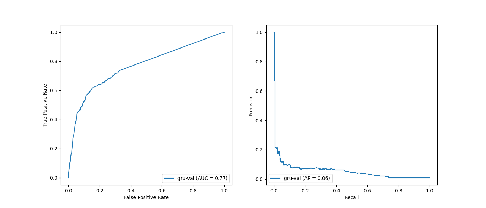 |
| -------------------------------------------------------- |
| Fig2.   (d) ROC, RPC, for GRU on validation                |

| 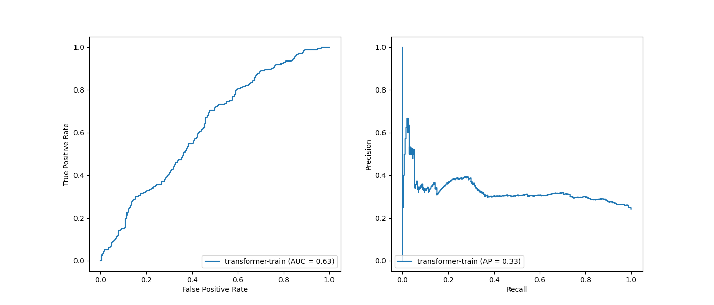 |
| -------------------------------------------------------- |
| Fig2.   (e) ROC, RPC, for Transformer on training                |

| 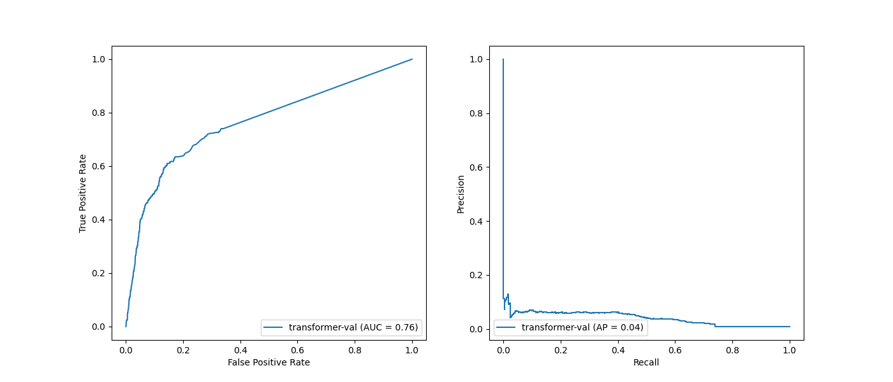 |
| -------------------------------------------------------- |
| Fig2.   (f) ROC, RPC, for Transformer on validation                |

Since the dataset is highly imbalanced and contains very few positive samples, PRC is a better option, for it neglect true negatives and focuses more on positives. However, I found most of the CTR tasks are widely evaluated with log loss (binary cross entropy) and AUROC.

Therefore, here I stick with the convention and report both AUPRC and AUROC in results summarized in the table. (The models are selected using AUROC/valid)

|             | LSTM   | GRU    | Transformer |
| ----------- | ------ | ------ | ----------- |
| epoch       | 33     | 56     | 137         |
| AUROC/train | 0.5909 | 0.6048 | 0.6276      |
| AUROC/valid | 0.7685 | 0.7676 | 0.7641      |
| AUROC/test  | 0.7987 | 0.7898 | 0.8074      |
| AUPRC/train | 0.3332 | 0.2926 | 0.3276      |
| AUPRC/valid | 0.0427 | 0.0552 | 0.0401      |
| AUPRC/test  | 0.0513 | 0.042  | 0.1019      |
| loss/train  | 1.798  | 0.0674 | 0.0382      |
| loss/valid  | 0.6569 | 0.1445 | 0.0435      |
| loss/test   | 0.6572 | 0.1509 | 0.0541      |

Notice that the training metrics including training loss cannot be compared with others evaluation metrics since the training dataset is reduced.

## (vii) Discussion

According to AUROC, the performance of three models are quite closed, for AUROC/valid, LSTM > GRU > Transformer, and for AUROC/test, Transformer > GRU > LSTM.

Generally, it needs more time and epochs for Transformer model to converge, whereas the LSTM and GRU needs less epochs and are more efficient on this dataset.

## (viii) Length of Sequences

| 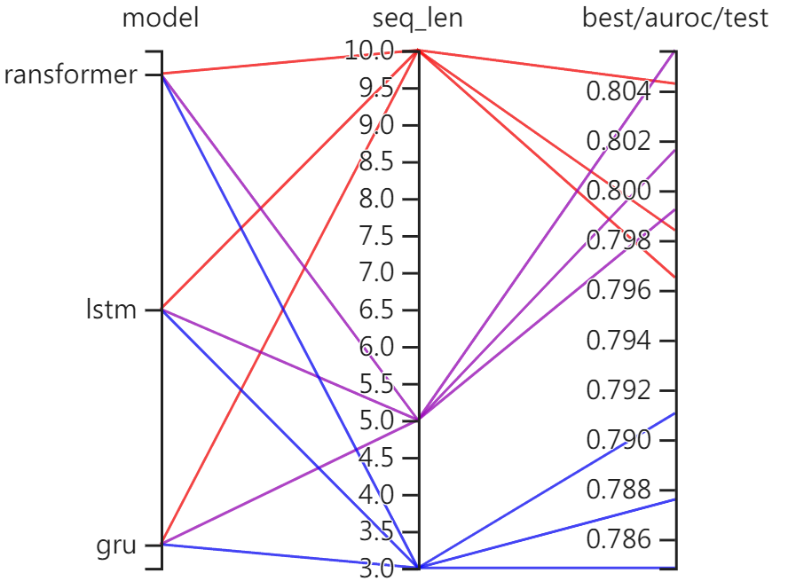 |
| ----------------------------------------------------- |
| Fig3. $N-\text{AUROC}$ on three models                |

As the figure3 shows, the results of $N=10$ and $N=5$ are similar, whereas there are noticeable drops between the results of $N=3$ and others.

Intuitively, longer sequences as inputs should lead to better results since more information is available.

However, it's likely the usability of the information can saturate for two reasons. Firstly, earlier histories are less useful than later histories, and using longer sequences indicates more earlier histories are used. Secondly, longer sequences may be harder to process for models, potentially leading to the saturation.
