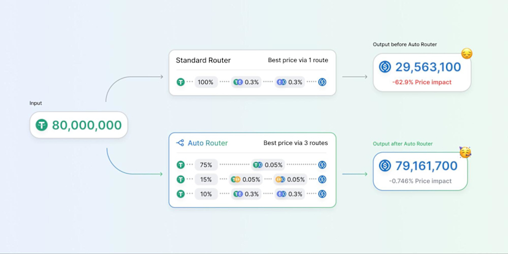
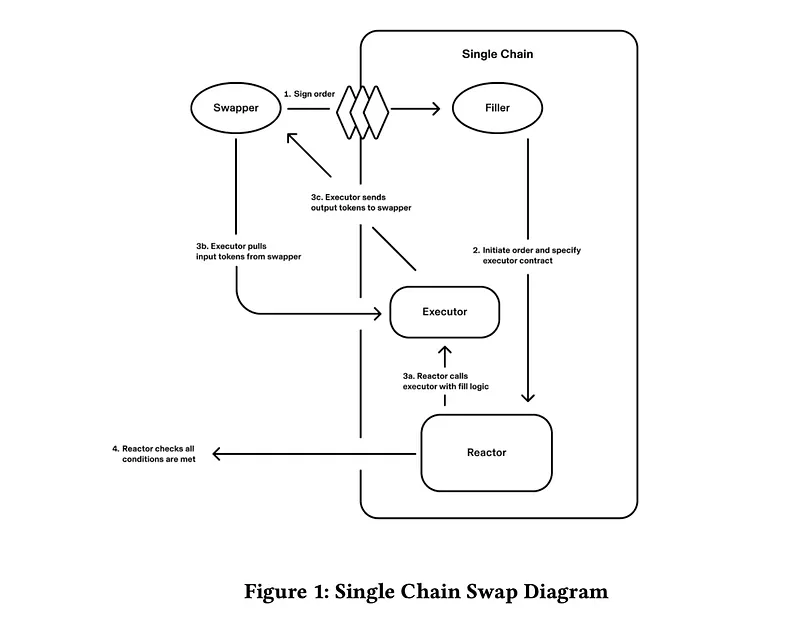
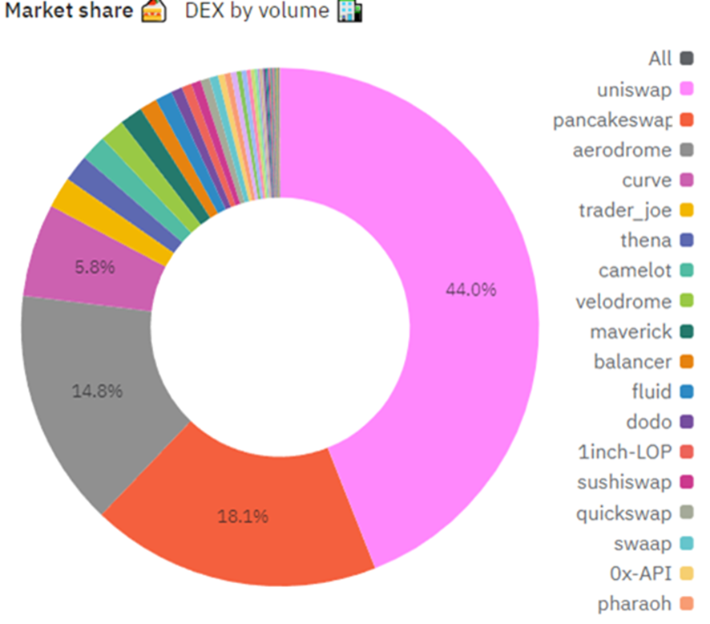
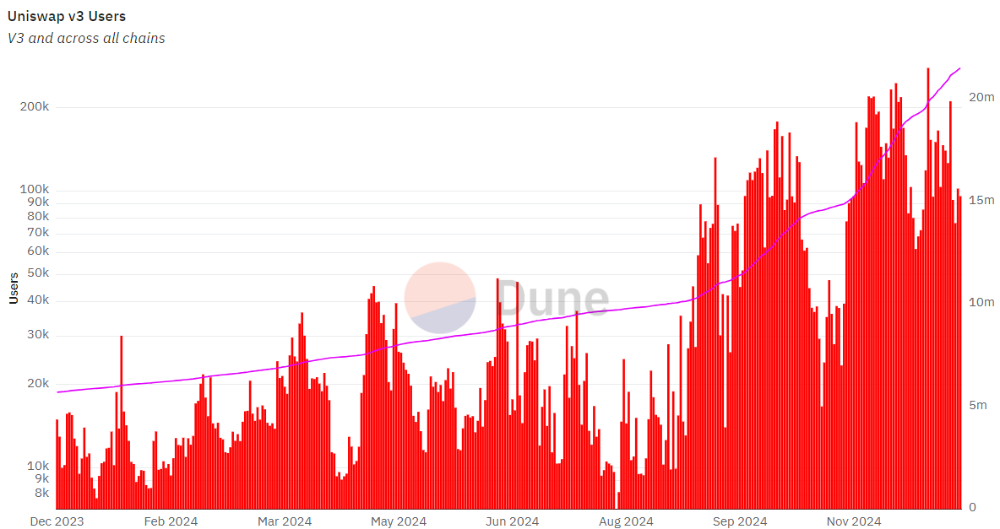

# MEV DEX - UniSWAP

## Outline

- [Introduction](#Introduction)
- [Preliminary](#交易所%20(Exchange))
    - [交易所 (Exchange)](#交易所%20(Exchange))
    - [CEX vs DEX](#CEX%20vs%20DEX)
    - [為何我們需要 DEX？](#為何我們需要%20DEX？)
    - [AMM (Automated Market Maker)](#AMM%20(Automated%20Market%20Maker))
    - [無常損失（Impermanent Loss）](#無常損失（Impermanent%20Loss）)
    - [MEV 攻擊](#MEV%20攻擊)
- [UniswapX](#UniswapX)
    - [Dutch Auctions （荷蘭拍賣）](#Dutch%20Auctions%20（荷蘭拍賣）)
    - [跨鏈交易（Cross-Chain Swaps）](#跨鏈交易（Cross-Chain%20Swaps）)
- [Uniswap 數據與分析](#Uniswap%20數據與分析)
- [核心價值與優劣分析](#核心價值與優劣分析)
- [競爭者](#競爭者)
- [展望：「UniChain」](#展望：「UniChain」)
- [參考資料](#參考資料)

## Introduction

去中心化交易所（DEX）現在已是 DeFi 生態系統中的不可或缺的一環，為用戶提供透明、無需許可且高效的數位資產交易方式。
在眾多平台中，Uniswap 不但是開創者，至今也仍是市佔第一的 DEX 品牌，通過其自動化做市商（AMM）協議徹底改變了 crypto 的交易模式。

Uniswap Labs 成立於 2018 年，由 Hayden Adams 創立，是推動 Uniswap 協議的主要力量。
自問世以來，該協議已促成超過 2.4 兆美元的交易量，並持續作為 DeFi 的關鍵基礎設施。Uniswap Labs 團隊還推出了創新工具，例如自主管理的錢包和交易 API，讓用戶能夠輕鬆存取包括 Ethereum、Polygon 和 Optimism 在內的多條區塊鏈上的流動性。

該項目的成功背後是穩健的資金支持。Uniswap 通過三輪融資籌集了 1.76 億美元，其中包括 2022 年 10 月創紀錄的 1.65 億美元 B 輪融資。這些資金使公司估值達到 16.6 億美元，鞏固了其作為獨角獸企業的地位。Uniswap 的知名投資者包括 Polychain、Paradigm 和 a16z 等幣圈龍頭。

本文將會介紹 Uniswap 的緣起，是如何開創今日 DEFI 中的核心角色 AMM (Automated Market Maker)，以及 AMM 的核心理論。
在 V1 推出一年後，V2 也推出許多新的功能和最佳化；V3 則給 LPs (Liquidity Providers, 流通性提供者）更多的可玩性，包含設定價格區間、費用級距等。
2024 年，UniswapV4 以及 UniswapX 推出。

本文篇幅會著重於介紹 Uniswap 第五代—UniswapX。
值得一提的是，若讀者不熟悉 DEX，也許會以為 Uniswap 和 iPhone 一樣，在我們有了 iPhoneX 之後就不需要 iPhone1~4 了；然而 UniswapV2~V4仍然作為基礎設施（Infrastructure）作為 DEX 交易中最底層、核心的一環。而最新的 UniswapX 則屬於 DEX Aggregator 或 Meta Aggregator，因此何其他先前的版本，其實是並行，而非互相取代的。

## 交易所 (Exchange)

在談及複雜的 DEX 理論及原理前，也許我們該回歸初心，從最基礎的「何謂交易所」開始說起。
在一般的金融交易所中，存在交易撮合引擎，其作用是透過撮合兩方對於資產及價格的要求，使得兩方達成共識並完成交易。
交易所即成為資產完成交易的場所。
舉例來說，Alice 擁有一個黑色的幣，Bob 擁有一個白色的幣，Alice 希望以一個黑色的幣換取一個白色的幣，Bob 則反過來享用一個白色的幣換取一個黑色的幣，她下了訂單
，而 Bob 也下了訂單。交易撮合引擎將這兩筆訂單進行匹配，使兩者達成協議，以 1:1 的比例完成了黑色與白色的幣的交換。

訂單簿（Order Book）記錄了各用戶下的訂單，左邊是買單，右邊是賣單。
圖中可以看到想要購買資產的人最高價格在 \$418.40 USD，而最低的賣價則是 \$418.41 USD，顯然在價格上雙方並未達成共識。圖中的高度代表可交易數量，若我們將每個價格乘以可交易數量再加總就是所謂的深度，訂單簿的深度越深代表市場的流動性越好，表示市場能提供的交易量越高，一般而言，流動性好的市場手續費較低。

## CEX vs DEX

CEX （Centralized Exchange，中心化交易所）是由公司或私人機構所開立並提供買賣數位資產、加密貨幣的平台，用戶必須先開立個人帳戶，並通過身份審查程序後，才可以掛單進行交易。
而加密貨幣的資產需轉入平台，由平台暫為保管。

DEX （Decentralized Exchange，去中心化交易所）與 CEX 一樣，可提供用戶買賣交易加密貨幣資產，但不同地方在於 DEX 沒有中央機構來跟蹤訂單簿、匹配訂單，DEX 則是藉由訂單簿與 AMM （Automated Market Maker，自動做市商） 來匹配交易。
去中心化的訂單簿系統，透過演算法進行用戶間的交易，並用智能合約將交易記錄在區塊鏈上，反應買賣雙方流動的代幣和金額，而自動做市商不用傳統訂單簿的方式匹配買賣雙方，而是透過創建流動池方式，用演算法為流動池的資產進行定價，並獎勵做市商和流動性提供者來解決流動池流動性不足的問題，使用者非透過買賣雙方間進行交易，而是使用流動池進行交易。

- CEX
    - 優點：交易撮合迅速，取消訂單無須手續費。
    - 缺點：不具抗審查性，使用者需揭露隱私，帳戶可能因其他因素被停權。CEX 可能進行搶先交易，內部人士得知即將進行的交易，可能在交易處理前進行操控以獲益。
- DEX
    - 優點：具抗審查性，使用者能保有隱私，分散在區塊鏈上，相對穩固。
    - 缺點：交易撮合過程較緩慢，每一步訂單操作都需要手續費，包括創建與取消交易。可能出現礦工或交易者執行搶先交易。
    

## 為何我們需要 DEX？

假設 Alice 想提供資金給交易者以增加流動性並賺取手續費，在 CEX 中她需要信任別人將資金託管出去才能達到目的。
如果她不想讓別人掌握她的資產，而想無託管地掌握在自己手中，DEX 就能夠滿足她的需求。此外，假設 Bob 是個專業交易員，想要在可靠的交易所上購買某個最新的幣種，DEX 能夠提供他更多選擇，並根據他的需求進行交易。這在 CEX 上可能不容易找到。在 DEX 中，Alice 和 Bob 可以運行價格發現與交易撮合，通過智能合約進行交易結算，最後上鏈執行。

## AMM (Automated Market Maker)

AMM 是一種 DEX 的協議，通過數學公式對資產進行定價。與傳統交易所不同，AMM 不使用傳統訂單簿，而是使用價格演算法進行資產定價。
AMM 為區塊鏈提供卓越的設定，提升了交易效率，並促進了DeFi 的規模增長。在 AMM 中，智能合約充當做市商，提供流動性。
例如，Alice 可以為 X 和 Y 提供流動性，將 X 和 Y 代幣存入流動性池中。當 Bob 想要透過支付手續費進行 X 兌換 Y 時，智能合約將匹配交易，完成資金交換。

以在 UniwapV1 V2中使用的 CPAMM （Constant Product AMM，恆定乘積做市商）模型為例，其公式為 $x \times y = k$，表示資產 $x$ 數量和資產 $y$ 數量的乘積為一個固定的常數。
在這個模型中，無論交易規模大小，都具有即時流動性。
此模型可在任何時間進行交易，而不需等待對手方，不同於在訂單簿模型中，進行的是對手盤交易，想要有買必須有賣，只有單一方是無法完成交易。
而資產 $x$ 和 $y$ 的價格由其資產量決定，數量多時價格下跌，數量少時價格上漲。

一個更具體的例子是：一個 ETH/DAI 池中在一開始的時候擁有 10 ETH、1000 DAI 的流動性。

$$
\begin{gather}
10 \text{ ETH} \times 1000 \text{ DAI} = 10^4
\end{gather}
$$
這時，一個使用者欲以 1000 DAI 來換取 ETH，因此他在池中加入 1000 DAI，同一時間池會反還 ETH 以重新滿足公式。
$$
\begin{gather}
(10 - \Delta x_1) \text{ ETH} \times (1000 + 1000) \text{ DAI} = 10^4
\\\\
\implies \Delta x_1=5 \text{ ETH}
\end{gather}
$$

若這個時候我們再進行第二次交易，同樣以 1000 DAI 換取 ETH，
$$
\begin{gather}
(5 - \Delta x_2) \text{ ETH} \times (2000 + 1000) \text{ DAI} = 10^4
\\\\
\implies \Delta x_2=1.67 \text{ ETH}
\end{gather}
$$

這時可以發現同樣的 DAI 能換取的 ETH 變少了。這點和傳統市場機制有些類似，在供給量下降的時候，價格會升高；供給量上升的時候，價格會下降。

在 2018 三月，UniswapV1 是早期第一批將 CPAMM 實作的應用。V1 中的 Factory contract 可以讓第三方建立 pools，並且可以讓任意數量的錢包來提供流通性。

## 無常損失（Impermanent Loss）

當我們向流動性池提供流動性時，存入的資產價格會隨著時間波動變化，同時池中的資產比例會發生變化，將我們投入的份額換算現在價值，如果當初一直持有該資金而不存入流動池會賺到更多利潤的話，這之中的差額就是無常損失。

## MEV 攻擊

在 CEX 中，先到先得是主要原則，而在 DEX 中，Miner/Validator 則是從公開的 Mempool 中選取一些交易進行打包上鏈。其中選取的順序是取決於 Gas Price 的高低，因為一個區塊存在 Gas 上限，Miner/Validator 預設下會按照 Gas Price 將交易從高到低排序，以獲得最高的 Gas Fee 收益。

這個機制直接導致交易方可以透過監視 Mempool 以及調整 Gas Fee 高低來操作交易順序來套利。

MEV（Miner/Maximum Extractable Value，最大可提取價值）是指一個區塊的 Miner/Validator 通過在其生產的區塊內任意插入、排除或重排序交易所獲得的利潤。
簡單來說，MEV 是一種利用交易排序來套利的行為。

MEV 有以下幾種類型

- **前沿交易（Front-Running）**

    前沿交易是攻擊者在執行隊列中將其交易置於已知特定交易之前。這通常是通過使用專用的前沿交易機器人，這些機器人在去中心化交易所上搜索大型訂單。然後，機器人提交具有更高 Gas Fee 的競爭性交易，排在受害者的交易之前，可以用較低價格買到特定幣。

- **後沿交易（Back-Running）**
    
  後沿交易是指攻擊者在已知的目標交易之後立即放置其交易。搜索者使用後沿交易機器人監視內存池，尋找新的代幣 pair 列表或 DEX 上 創建的流動性池。當找到新的代幣pair 列表時，機器人會立即放置一個交易訂單，在初始流動性之後購買盡可能多的代幣，只留下一小部分給其他交易者之後購買。然後機器人就等待價格在其他交易者購買代幣後上漲，再以更高的價格出售獲利。
      
- **三明治攻擊（Sandwich Attacks）**

     三明治攻擊則是攻擊者在特定交易前後各安插一筆交易，先進行交易推高價格，等受害者買單將價格進一步推高後再出售此代幣。
 

對於 MEV 攻擊，一些人認為他是乙太坊的市場本質機制，且能夠幫助找到更有效率的市場價格。不過，普遍我們還是認為 MEV 是會對所有的交易者不利，尤其是對於新手來說，他們甚至可能無法意識到自己「被攻擊」而蒙受損失。

## UniswapX

即便 UniswapV3 中已經提出了 Auto Router 的概念，在眾多流通池中找尋最好的交易路徑，隨著市場上 DEX 越來越蓬勃發展，Routing 已經成為了非常難解的問題之一。

這也是推生 UniswapX 的主要原因和動機。正如DEX核心：去中心化，UniswapX 也從善如流，透過將 routing problem 變成競賽，讓第三方來解決問題並獲得獎勵。這對於使用者（Swapper）而言，從提交 Intent 而非直接的 Transaction。這還有個非常重要的好處，也就是轉嫁的MEV和 Gas fee 給實際上的交易者、解題者（Filler）。此外，對於使用者而言，整體的交易流程仍然和原來是相似的，就像是開限價單一樣。

### Dutch Auctions （荷蘭拍賣）

Intent-based 交易聽起來好處多多，但具體究竟是如何實作變成競賽的呢？整個競賽，也就是 Dutch Auctions ，大致上可寫成以下流程：

- Dutch Auctions 對於一個由 **Swapper** 提交的交易 intent 會從高價開始拍賣，價錢會隨時間降低，會一直持續到一個設定的最低價。
- 隨著價錢的降低，對於 **Fillers** 而言，交易會變得越來越有利可圖，因此這也促使 Fillers 彼此競爭，想辦法越快搶到交易越好。
- 對於 Swappers 而言，交易越快完成，也代表換到的 tokens 數量較多。
- Fillers 在找到有利可圖的 Order 後，能提交給 **Reactor contract**，其負責檢查 Fillers 的交易是否滿足 Users 的交易參數。
- 最後，**Executor contract** 會負責執行最後的 filling，也就是收取 Swappers 對應的交易代幣，並給與其預交換的代幣。

### 跨鏈交易（Cross-Chain Swaps）

跨鏈交易是 UniswapX 領先其他競爭者的一個重要功能。UniswapX 能夠執行的交易可以分成三種：

- Same-Chain swaps（同鍊交易）：使用者在這種交易中，和 Fillers 的互動是一瞬間完成的。當 Intent 被執行後，Filler 也同時得到使用者的資產。
- Cross-Chain swaps （跨鏈交易）：由於交易是發生在不同的鏈，這會需要 Settlement oracle 來確認交易，這個部份需要花費比較多的時間，也因此相比同鍊交易，這會慢上許多。
- Fast cross-chain swaps（快速跨鏈交易）：顧名思義是比較快的跨鏈交易。在這種交易中，使用者在簽署交易時設定 Challenge（一種驗證者），理想上能夠在所有交易參與者都滿足條件的情況下達到合同鍊交易一樣的速度。

## Uniswap 數據與分析

- 市占率：以市占而言，Uniswap 迄今仍然是在各家 DEX 中首趨一指。

[^dune]

- 作為 DEX 的先驅之一，Uniswap 的使用者數量，仍然持續成長，2024年的使用者年成長率達到了約 400%。

## 核心價值與優劣分析

- **最佳化交易價格**：使用者理論上能夠取得最優的價格。（透過 Dutch Auctions 的競爭機制）
- **流通性擴展**：使用者能夠利用到更多元的 Liquidity。
-  **MEV保護**：使用者能夠避免 MEV 攻擊，並且能有機會取得 MEV 獎勵。如前所述，因為使用者不是實際上的交易者，因此若 slippage （滑價）發生，使用者不用直接負擔其成本，但若是正向的 slippage ，使用者理論上也能從價格中得到反還值。
- **免 Gas Fee**：使用者不再需要為失敗的交易付 Gas fee。

## 競爭者

以下表格比較了 UniswapX 與另外兩個競爭對手 CoWSwap 與1inch fusion的差異。

| 項目        | UniswapX                                                                                          | CoWSwap                                                             | 1inch fusion                                                 |
| --------- | ------------------------------------------------------------------------------------------------- | ------------------------------------------------------------------- | ------------------------------------------------------------ |
| 第三方       | filler                                                                                            | solver                                                              | resolver                                                     |
| 執行過程      | 贏得報價的 filler 在一定時間內有執行的優先權，之後進行荷蘭拍賣                                                               | 將所有 solver 的解決方案提交給 Driver 排名，一旦投標結束，即所有解決方案都已提交並排名，播報排名資訊，通知排名第一執行 | 隨時間增加 resolver 的數量，同時價格衰減。1inch fusion 在最初一分鐘只有 1 個 resolver |
| Batch 形成  | 個別處理                                                                                              | 將鏈上所有未結訂單，打包成一個 batch 進行荷蘭拍賣，可以組合訂單匹配 CoW                           | 個別處理                                                         |
| 訂單參數化程度   | 使用者有更多的自由來定義參數，包括拍賣的衰減函數、初始荷蘭訂單價格等。                                                               | 使用者只需要提供交換代幣和滑點。CoW Swap 還可以設置訂單的持續時間                               | 使用者只需提供交換代幣和滑點                                               |
| 第三方的流動性來源 | 允許任何 filler 能接觸到的流動性源，即允許私人流動性。                                                                   | CoW 和外部流動性源。                                                        | 通常是大型的做市商                                                    |
| 去中心化程度    | 絕對 permissionless，任何人可以通過 API 訪問未結訂單，發送給 Reactor 與其他 filler 的方案競爭                                 | 要麼通過創建 $1M 的 USDC/COW 的池子被列入白名單; 要麼根據 DAO 的標準被 Cow DAO 列入白名單        | 需要註冊，進行 KYC 流程，並保持足夠的餘額來支付訂單費用                               |
| 報價來源      | 允許 filler 報價（RFQ），即允許 filler 初始化荷蘭拍賣的初始價格                                                         | API 報價                                                              | API 報價                                                       |
| 激勵機制      | 允許訂單在一定時間內指定 filler 執行訂單（之後進行荷蘭拍賣），以此激勵 filler 向 RFQ 系統報價。 為了限制 filler 對這種獨家權利的濫用，可能引入相應的聲譽或懲罰系統。 | 每週一次獎勵上周成單率最高的 Solver 實現激勵                                          | 未提及                                                          |
| 跨鏈聚合功能    | 可以擴展到支援跨鏈交易，交換和跨鏈被合併成一個單獨的動作，不需要交換者直接與橋交互，就可以將原始鏈上持有的資產交換到目標鏈上所需的資產。                              | 仍在討論中                                                               | 仍在討論中                                                        |

## 展望：「UniChain」

Uniswap 的發展藍圖隨著 **UniChain** 2024年10月的發布邁出了重要一步。
UniChain 是一個 L2 Chain， 致力於解決乙太坊面臨的核心挑戰。
Uniswap，作為乙太燃料首位消費者，在引入了快速、去中心化且低成本的 "Superchain L2" 平台，可望成使其為多鏈之間 DeFi 和流動性的中心樞紐。

UniChain 的核心特色包括：

1. **低成本去中心化** ：  UniChain 在保持去中心化的同時，將交易成本降低約 95%，相較於以太坊 L1。透過採用以太坊的 Rollup 擴展策略，UniChain 引入了一個去中心化的驗證網路，進一步提升了安全性、可靠性和透明性。
2. **速度與效率**：UniChain 提供一秒區塊生成時間，並計劃導入 250 毫秒的子區塊，以實現接近即時的交易體驗。這些技術改進提高了市場效率，並減少了因 MEV造成的損失。與 Flashbots 合作開發的受信執行環境（TEE）還增強了交易的透明性和安全性。
3. **無縫多鏈交換**：作為 Optimism Superchain 的一部分，UniChain 提供了原生的跨鏈互操作性，實現高效的鏈間通信。通過 ERC-7683 等倡議，使用者將能在不同鏈之間享受無縫體驗。此外，UniChain 計劃在啟動後不久將跨鏈交換功能整合至 Uniswap 界面和錢包中。

在開源與開發者支持的部份，UniChain 採用模組化架構，開放源代碼授權，並積極參與 OP Stack 的開發，是以太坊擴展的重要工具。Uniswap Labs 鼓勵開發者通過 UniChain Builder Toolkit 和 Uniswap 基金會的支持參與開發，共同推動 DeFi 生態的繁榮。

隨著測試網現已上線，主網計劃於今年稍後推出，UniChain 標誌著 Uniswap 推動 DeFi 創新與可擴展性的里程碑式進展。

---

## 參考資料

- [UniSwap](https://app.uniswap.org/swap)
- [CoWSwap](https://cow.fi/)
- https://blog.li.fi/uniswapx-a-deep-dive-4b4ea7673dc1
- https://blog.uniswap.org/how-uniswapv4-uniswapx-work-together
- https://etherworld.co/2022/04/05/mev-research-report/
- https://blog.uniswap.org/introducing-unichain

[^dune]: [Dune](https://dune.com/cowprotocol/cowswap)